# Backend-App Documentation

## Table of Contents

1. [Architecture Overview](#architecture-overview)
2. [Code Architecture Diagram](#code-architecture-diagram)
3. [Folder Structure](#folder-structure)
4. [Technology Stack](#technology-stack)
5. [Observability](#observability)
6. [Infrastructure & Domain Connections](#infrastructure--domain-connections)
7. [Local Development Guide](#local-development-guide)

---

## Architecture Overview

The backend-app follows a **monolithic architecture with domain-driven design**. All services run in a single process but are organized by business domain. This approach provides:

- **Simplicity**: Single deployment unit
- **Performance**: In-memory communication between domains
- **Maintainability**: Clear domain boundaries
- **Scalability**: Can be split into microservices if needed

### Key Architectural Patterns

| Pattern | Description | Location |
|---------|-------------|----------|
| **Layered Architecture** | Handler → Service → Repository | All domains |
| **Repository Pattern** | Data access abstraction | `domain/*/repository` |
| **Cache-Aside Pattern** | Redis + PostgreSQL | All domains |
| **Middleware Chain** | Cross-cutting concerns | `infrastructure/http/middleware` |
| **Dependency Injection** | Constructor-based injection | All handlers/services |

---

## Code Architecture Diagram

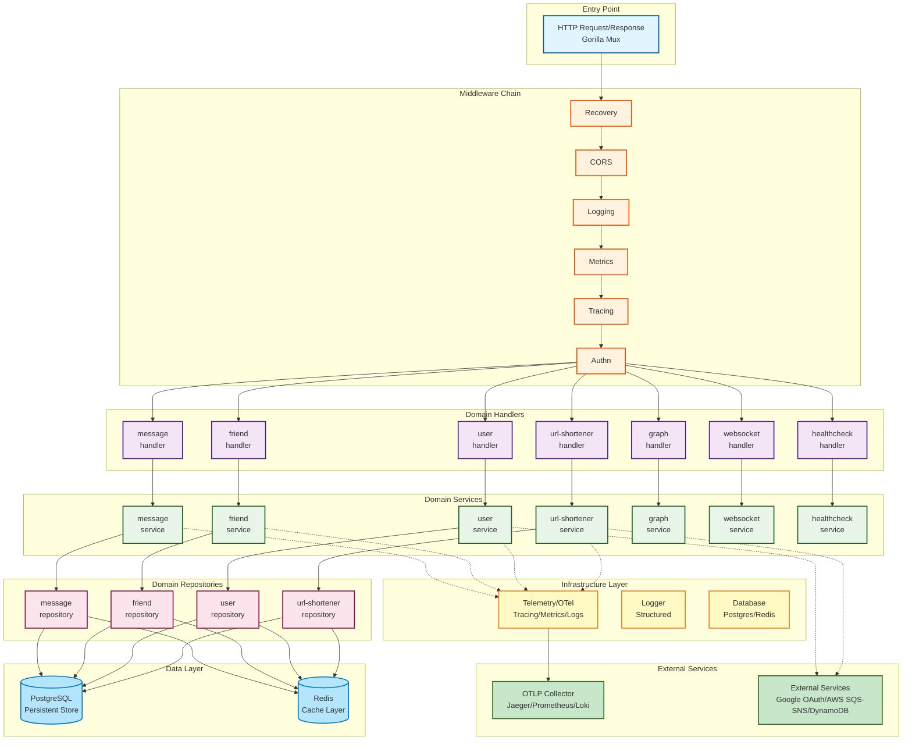

### Request Flow Example (URL Shortener)

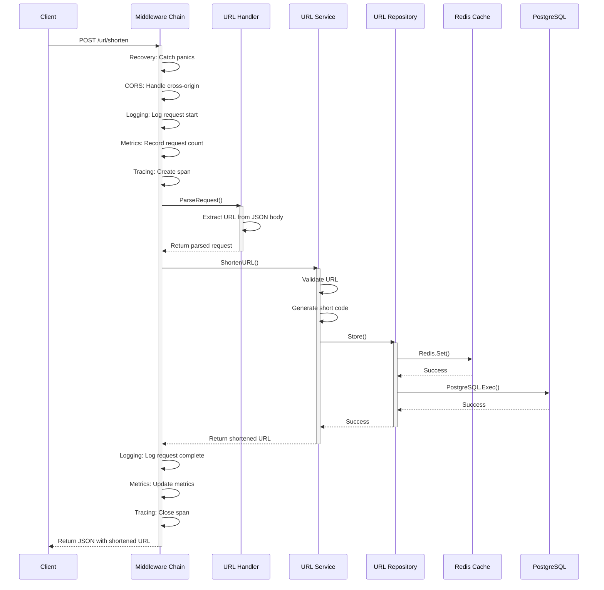

---

## Folder Structure

```
backend-app/
├── binary/                          # Application entry points
│   ├── main.go                     # Main binary with all domains
│   └── http/                       # HTTP-specific binary
│       ├── main.go                 # HTTP server entry point
│       └── docs/                   # Swagger documentation
│
├── domain/                          # Business logic domains
│   ├── url-shortener/              # URL shortening service
│   │   ├── dto/                    # Data transfer objects
│   │   │   └── url.go             # URL structs & mappings
│   │   ├── handler/                # HTTP handlers
│   │   │   └── url.go             # Request/response handling
│   │   ├── service/                # Business logic
│   │   │   └── url.go             # URL shortening logic
│   │   └── repository/             # Data access
│   │       ├── url.go             # Repository interface
│   │       ├── cache.go           # Redis implementation
│   │       └── persistent.go      # PostgreSQL implementation
│   │
│   ├── user/                       # User authentication service
│   │   ├── dto/                    # User DTOs
│   │   ├── handler/                # User HTTP handlers
│   │   ├── service/                # User business logic
│   │   ├── repository/             # User data access
│   │   └── integration/            # External integrations
│   │       └── google_oauth.go    # Google OAuth integration
│   │
│   ├── friend/                     # Friend management service
│   ├── graph/                      # Graph visualization service
│   ├── message/                    # Message handling service
│   └── healthcheck/                # Health monitoring service
│
├── infrastructure/                  # Shared infrastructure
│   │
│   ├── database/                   # Database abstractions
│   │   ├── postgres/               # PostgreSQL interface
│   │   │   ├── client.go          # Connection management
│   │   │   └── postgres.go        # Query operations
│   │   └── redis/                  # Redis interface
│   │       ├── client.go          # Connection management
│   │       └── redis.go           # Cache operations
│   │
│   ├── http/                       # HTTP infrastructure
│   │   ├── handler/                # Common handlers
│   │   │   └── response.go       # Response utilities
│   │   └── middleware/            # HTTP middleware
│   │       ├── chain.go           # Middleware chaining
│   │       ├── cors.go            # CORS handling
│   │       ├── logging.go         # Request logging
│   │       ├── metrics.go         # Metrics collection
│   │       ├── recovery.go        # Panic recovery
│   │       ├── response_time.go   # Response timing
│   │       ├── tracing.go         # Distributed tracing
│   │       └── auth.go            # Authentication
│   │
│   ├── telemetry/                 # Observability stack
│   │   ├── logger/                # Structured logging
│   │   │   ├── logger.go         # Logger implementation
│   │   │   └── middleware.go     # Logging middleware
│   │   ├── metrics/               # Metrics collection
│   │   │   ├── metrics.go        # OTEL metrics setup
│   │   │   └── middleware.go     # Metrics middleware
│   │   └── span/                  # Distributed tracing
│   │       ├── span.go           # OTEL tracing setup
│   │       └── middleware.go     # Tracing middleware
│   │
│   ├── instance/                  # Infrastructure instances
│   │   ├── local/                # Local development
│   │   │   └── docker-compose.yaml
│   │   └── prod/                 # Production configs
│   │
│   └── deployment/                # Deployment configs
│       ├── collector/            # OpenTelemetry collector
│       └── deployments/          # Kubernetes manifests
│
├── makefile                       # Build & deployment automation
├── go.mod                         # Go module definition
└── go.sum                         # Dependency checksums
```

### Domain Service Structure Pattern

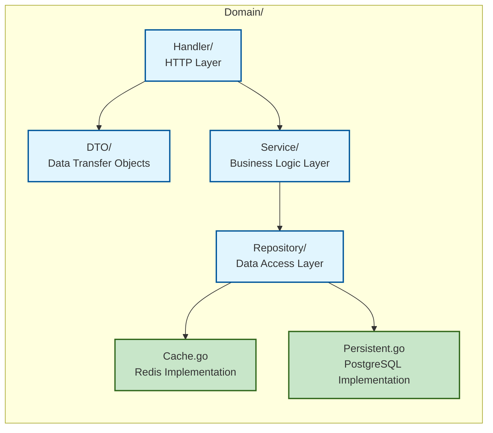

Each domain follows this consistent structure with:
- **DTO**: Request/response structs
- **Handler**: HTTP handlers
- **Service**: Service interface + implementation
- **Repository**: Repository interface
- **Cache.go**: Redis implementation
- **Persistent.go**: PostgreSQL implementation

---

## Technology Stack

### Core Technologies

| Component | Technology | Version | Purpose |
|-----------|-----------|---------|---------|
| **Language** | Go | 1.25 | Primary language |
| **HTTP Router** | Gorilla Mux | Latest | HTTP routing |
| **Database ORM** | SQLx | Latest | PostgreSQL queries |
| **Cache** | Redis (go-redis) | Latest | Caching layer |
| **Authentication** | JWT (golang-jwt) | v5 | Token management |
| **OAuth** | OAuth2 | Latest | Google authentication |
| **API Docs** | go-swagger | Latest | Swagger documentation |

### Observability Stack

| Component | Technology | Purpose |
|-----------|-----------|---------|
| **Tracing** | OpenTelemetry + Jaeger | Distributed tracing |
| **Metrics** | OpenTelemetry + Prometheus | Metrics collection |
| **Logging** | OpenTelemetry + Loki | Log aggregation |
| **Visualization** | Grafana | Metrics dashboards |
| **Service Mesh** | Kiali + Istio | Service visualization |

### Infrastructure

| Component | Technology | Purpose |
|-----------|-----------|---------|
| **Database** | PostgreSQL 15+ | Primary data store |
| **Cache** | Redis 7+ | Caching layer |
| **NoSQL** | DynamoDB | URL cache (AWS) |
| **Message Queue** | SQS/SNS | Async messaging |
| **Container** | Docker | Containerization |
| **Orchestration** | Kubernetes (Kind/EKS) | Container orchestration |
| **Ingress** | Istio | Service mesh & routing |

### Development Tools

| Tool | Purpose |
|------|---------|
| **Make** | Build automation |
| **Docker Compose** | Local development environment |
| **Kind** | Local Kubernetes cluster |
| **CloudFormation** | AWS infrastructure as code |
| **kubectl** | Kubernetes management |

---

## Observability

The backend-app implements a comprehensive observability stack using **OpenTelemetry** as the unified framework for logs, metrics, and traces.

### Observability Architecture

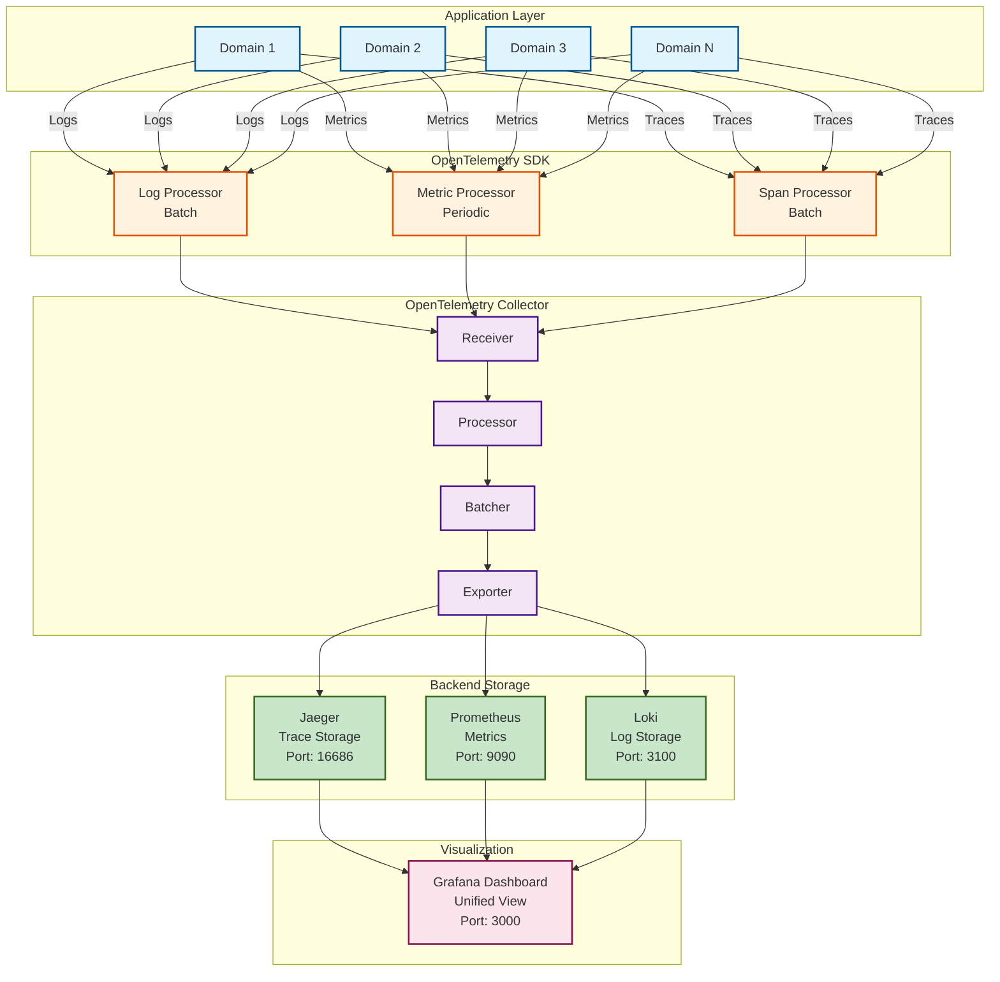

### 1. Logging

#### Implementation Location
`infrastructure/telemetry/logger/logger.go`

#### Features
- **Structured Logging**: Key-value pairs for machine parsing
- **Multiple Formats**: TEXT (human-readable) and JSON (machine-readable)
- **Log Levels**: DEBUG, INFO, WARN, ERROR
- **Automatic Metadata**: Timestamp, file/line number, caller info
- **OTLP Export**: Sends logs to OpenTelemetry Collector

#### Log Levels

| Level | Description | Use Case |
|-------|-------------|----------|
| **DEBUG** | Detailed debugging info | Development troubleshooting |
| **INFO** | General informational messages | Normal operation tracking |
| **WARN** | Warning messages | Potential issues that don't stop execution |
| **ERROR** | Error messages | Failures that affect functionality |

#### Usage Example

```go
import "github.com/msyamsula/portofolio/backend-app/infrastructure/telemetry/logger"

func HandleRequest(r *http.Request) {
    logger.Info("request started", map[string]any{
        "method": r.Method,
        "path":   r.URL.Path,
        "query":  r.URL.RawQuery,
    })

    // Business logic...

    logger.Error("operation failed", map[string]any{
        "error": err.Error(),
        "context": "shorten_url",
    })
}
```

#### Log Format

**TEXT Format:**
```
2026-02-14T10:30:45Z INFO [url-shortener] request started method=POST path=/url/shorten
```

**JSON Format:**
```json
{
  "timestamp": "2026-02-14T10:30:45Z",
  "level": "INFO",
  "service": "url-shortener",
  "message": "request started",
  "method": "POST",
  "path": "/url/shorten"
}
```

### 2. Metrics

#### Implementation Location
`infrastructure/telemetry/metrics/metrics.go`

#### Pre-defined Instruments

| Metric Name | Type | Description | Labels |
|-------------|------|-------------|--------|
| `http_requests_total` | Counter | Total HTTP requests | method, path, status_code |
| `http_request_duration_seconds` | Histogram | Request duration in seconds | method, path |
| `http_response_time_latest_seconds` | ObservableGauge | Latest response time | method, path |

#### Metrics Collection Flow

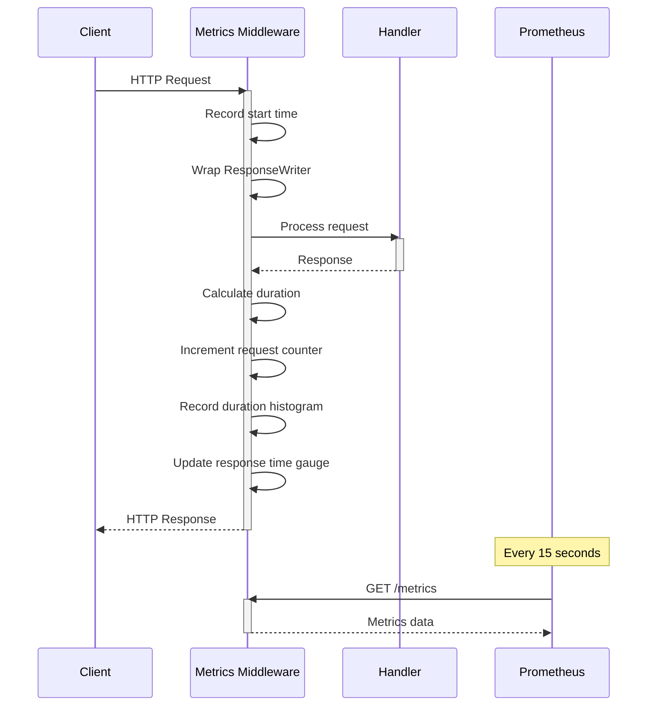

#### Example Metrics Output

```
# HELP http_requests_total Total HTTP requests
# TYPE http_requests_total counter
http_requests_total{method="POST",path="/url/shorten",status_code="200"} 1523

# HELP http_request_duration_seconds Request duration in seconds
# TYPE http_request_duration_seconds histogram
http_request_duration_seconds_bucket{method="POST",path="/url/shorten",le="0.005"} 100
http_request_duration_seconds_bucket{method="POST",path="/url/shorten",le="0.01"} 450
http_request_duration_seconds_bucket{method="POST",path="/url/shorten",le="0.025"} 800
http_request_duration_seconds_bucket{method="POST",path="/url/shorten",le="+Inf"} 1523
http_request_duration_seconds_sum{method="POST",path="/url/shorten"} 12.5
http_request_duration_seconds_count{method="POST",path="/url/shorten"} 1523
```

### 3. Distributed Tracing (Spans)

#### Implementation Location
`infrastructure/telemetry/span/span.go`

#### Tracing Features
- **OpenTelemetry SDK** for distributed tracing
- **OTLP gRPC exporter** for sending traces
- **Configurable sampling rate** (default 100%)
- **Batch processor** for efficient trace collection
- **W3C Trace Context** for context propagation

#### Span Architecture

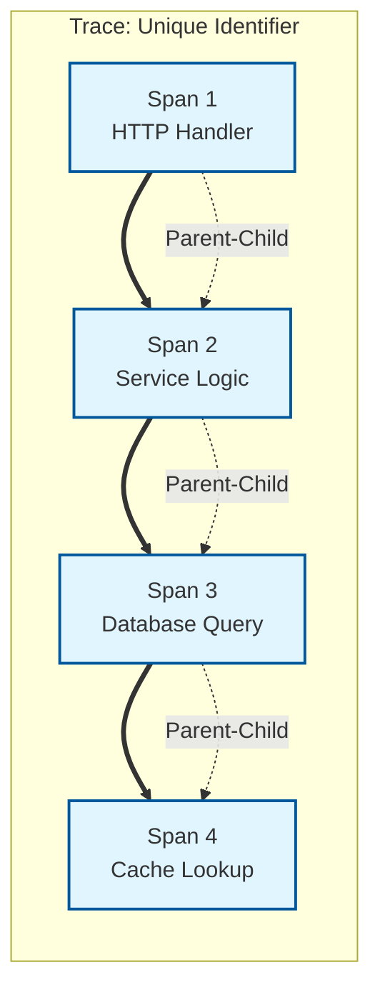

#### Span Attributes

Each span captures:
- **Service Name**: Which service generated the span
- **Operation Name**: What operation was performed
- **Start/End Time**: When the operation occurred
- **Duration**: How long the operation took
- **Attributes**: Key-value pairs (HTTP method, URL, status code)
- **Events**: Timestamped events within the span
- **Links**: Relationships to other spans

#### Trace Context Propagation

```go
// Incoming request carries trace context in headers
TraceParent: 00-4bf92f3577b34da6a3ce929d0e0e4736-00f067aa0ba902b7-01

// Handler extracts and uses existing trace context
// or creates new one if not present

// Service calls pass context to maintain trace
ctx := r.Context()
service.DoSomething(ctx)

// Database and cache calls inherit trace context
repo.Query(ctx)
cache.Get(ctx)
```

#### Viewing Traces in Jaeger

```
Jaeger UI: http://localhost:16686

Search by:
- Service Name (url-shortener, user, friend, etc.)
- Operation Name (HTTP method + path)
- Tags (status_code, error)
- Time range

Trace view shows:
- Overall timeline
- Individual spans with duration
- Service-to-service calls
- Database queries
- Cache operations
```

### Environment Configuration

All observability components are configured via environment variables:

| Variable | Description | Default |
|----------|-------------|---------|
| `OTEL_COLLECTOR_ENDPOINT` | OTLP collector address | `localhost:4317` |
| `SERVICE_NAME` | Service identifier | `backend-app` |
| `ENVIRONMENT` | Deployment environment | `local` |
| `LOG_LEVEL` | Log verbosity | `INFO` |
| `LOG_FORMAT` | Output format | `TEXT` |
| `OTEL_METRICS_INTERVAL` | Metrics push interval (ms) | `15000` |

### Observability in Action: Request Lifecycle

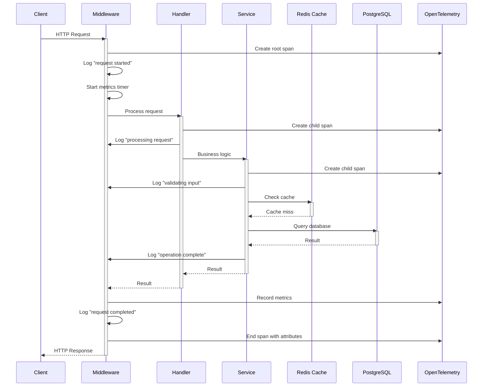

---

## Infrastructure & Domain Connections

### Infrastructure Architecture Diagram

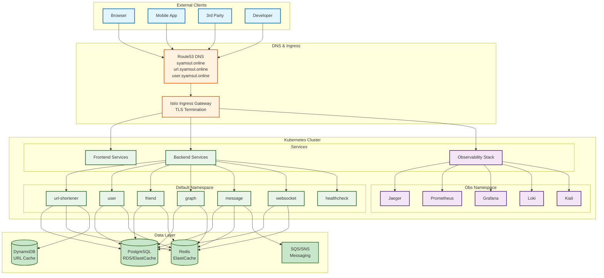

### Domain Communication Map

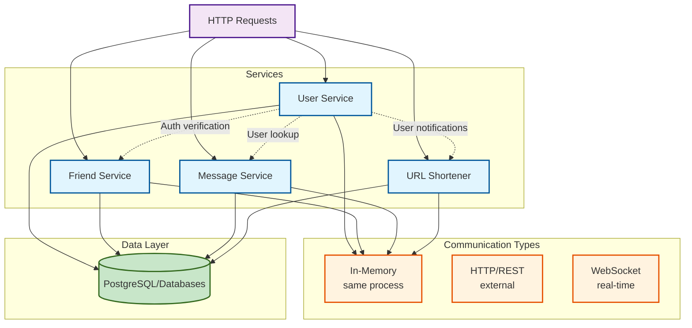

### External Service Dependencies

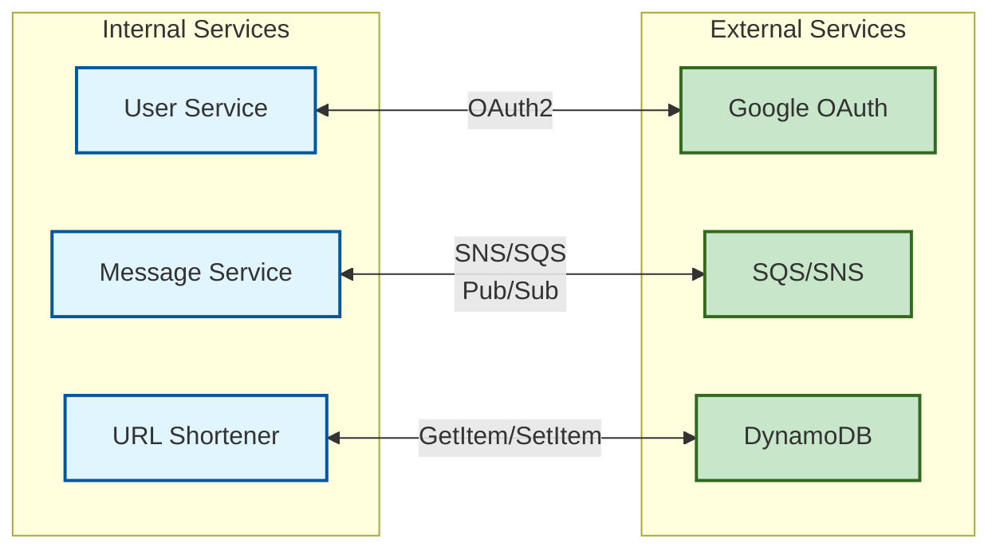

### Infrastructure Components

#### VPC & Networking (AWS)

```mermaid
graph TB
    subgraph "VPC 10.0.0.0/16"
        subgraph "Public Subnets<br/>10.0.1.0/24, 10.0.2.0/24"
            ISTIO[Istio Ingress]
            BASTION[Bastion Host]
            NAT[NAT Gateway]
        end

        subgraph "Private Subnets<br/>10.0.10.0/24, 10.0.11.0/24, 10.0.12.0/24"
            EKS[EKS Nodes]
            RDS[(RDS PostgreSQL)]
            ECACHE[ElastiCache Redis)]
        end
    end

    classDef public fill:#fff3e0,stroke:#e65100,stroke-width:2px
    classDef private fill:#e1f5fe,stroke:#01579b,stroke-width:2px

    class ISTIO,BASTION,NAT public
    class EKS,RDS,ECACHE private
```

#### Data Flow Diagram

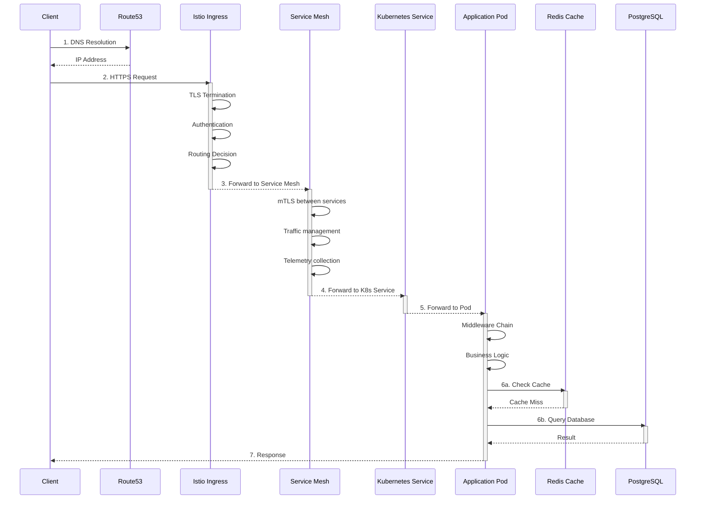

---

## Local Development Guide

This section walks you through setting up and running the backend-app locally.

### Prerequisites

Ensure you have the following installed:

| Tool | Version | Check Command |
|------|---------|---------------|
| Go | 1.25+ | `go version` |
| Docker | 20+ | `docker --version` |
| Docker Compose | 2+ | `docker-compose --version` |
| Make | Any | `make --version` |
| kubectl | 1.28+ | `kubectl version` |
| Kind | 0.20+ | `kind version` |

### Quick Start

The fastest way to get started:

```bash
# 1. Navigate to backend-app directory
cd /Users/m.syamsularifin/go/portofolio/backend-app

# 2. Start infrastructure dependencies
docker-compose -f infrastructure/instance/local/docker-compose.yaml up -d

# 3. Set environment variables
export $(cat .env | xargs)

# 4. Run the application
make local
```

The application will be available at `http://localhost:10000`

### Step-by-Step Walkthrough

#### Step 1: Start Infrastructure Services

The local infrastructure runs in Docker Compose and includes:

| Service | Port | Description |
|---------|------|-------------|
| PostgreSQL | 5432 | Primary database |
| Redis | 6379 | Cache layer |
| OTel Collector | 4317 | Telemetry collector |
| Jaeger | 16686 | Trace visualization (UI) |
| Prometheus | 9090 | Metrics collection |
| Grafana | 3000 | Metrics dashboard |
| Loki | 3100 | Log aggregation |

```bash
# Start all infrastructure services
docker-compose -f infrastructure/instance/local/docker-compose.yaml up -d

# Verify services are running
docker-compose -f infrastructure/instance/local/docker-compose.yaml ps

# View logs
docker-compose -f infrastructure/instance/local/docker-compose.yaml logs -f
```

#### Step 2: Configure Environment Variables

Each service uses environment variables for configuration. Create a `.env` file in the root directory:

```bash
# Copy example env (if available)
cp .env.example .env

# Or create manually
cat > .env << 'EOF'
# Service Configuration
SERVICE_NAME=backend-app
ENVIRONMENT=local
HTTP_PORT=10000

# Database Configuration
POSTGRES_HOST=localhost
POSTGRES_PORT=5432
POSTGRES_USER=postgres
POSTGRES_PASSWORD=postgres
POSTGRES_DB=portfolio

# Redis Configuration
REDIS_HOST=localhost
REDIS_PORT=6379
REDIS_PASSWORD=

# Observability
OTEL_COLLECTOR_ENDPOINT=localhost:4317
LOG_LEVEL=INFO
LOG_FORMAT=TEXT

# Authentication
JWT_TOKEN_TTL=24h
APP_TOKEN_SECRET=your-secret-key-here

# Google OAuth
GOOGLE_CLIENT_ID=your-client-id
GOOGLE_CLIENT_SECRET=your-client-secret
GOOGLE_REDIRECT_URL=http://localhost:10000/user/callback

# AWS (for SQS/SNS/DynamoDB - optional for local)
AWS_REGION=us-east-1
EOF
```

#### Step 3: Initialize Database

```bash
# Connect to PostgreSQL
docker exec -it backend-app-postgres-1 psql -U postgres -d portfolio

# Create tables (if not using auto-migration)
CREATE TABLE IF NOT EXISTS users (
    id SERIAL PRIMARY KEY,
    email VARCHAR(255) UNIQUE NOT NULL,
    name VARCHAR(255),
    created_at TIMESTAMP DEFAULT NOW()
);

-- Add more tables as needed...
```

#### Step 4: Run the Application

```bash
# Using make
make local

# Or directly with go
go run binary/main.go

# Or build and run
go build -o bin/backend binary/main.go
./bin/backend
```

#### Step 5: Verify the Application

```bash
# Health check
curl http://localhost:10000/health

# View swagger docs
open http://localhost:10000/docs

# View Prometheus metrics
open http://localhost:10000/metrics

# View Jaeger traces
open http://localhost:16686

# View Grafana dashboards
open http://localhost:3000
```

### Local Services Endpoints

| Endpoint | Method | Description |
|----------|--------|-------------|
| `/health` | GET | Health check |
| `/url/shorten` | POST | Create shortened URL |
| `/url/{code}` | GET | Resolve shortened URL |
| `/user/login` | POST | User authentication |
| `/friend/add` | POST | Add friend |
| `/friend/list` | GET | List friends |
| `/message/send` | POST | Send message |
| `/graph/viz` | POST | Graph visualization |
| `/metrics` | GET | Prometheus metrics |
| `/docs` | GET | Swagger documentation |

### Debugging Tips

#### Check Application Logs

```bash
# Application logs are stdout/stderr
# View via docker-compose if running in container
docker-compose -f infrastructure/instance/local/docker-compose.yaml logs -f backend

# Or use Loki/Grafana for centralized logging
open http://localhost:3000
```

#### Trace a Request

```bash
# Make a request with trace ID
curl -H "Traceparent: 00-$(uuidgen)-$(uuidgen)-01" http://localhost:10000/health

# View in Jaeger
open http://localhost:16686
```

#### Connect to Database

```bash
# PostgreSQL
docker exec -it backend-app-postgres-1 psql -U postgres -d portfolio

# Redis CLI
docker exec -it backend-app-redis-1 redis-cli
```

### Common Development Tasks

#### Hot Reload during Development

```bash
# Install air for hot reload
go install github.com/cosmtrek/air@latest

# Create .air.toml configuration
cat > .air.toml << 'EOF'
root = "."
tmp_dir = "tmp"
[build]
cmd = "go build -o ./tmp/main ./binary/main.go"
bin = "tmp/main"
include_ext = ["go"]
exclude_dir = ["tmp", "vendor"]
delay = 1000
EOF

# Run with hot reload
air
```

#### Run Tests

```bash
# Run all tests
go test ./...

# Run tests with coverage
go test -cover ./...

# Run tests for specific domain
go test ./domain/url-shortener/...

# Run tests with verbose output
go test -v ./...
```

#### Build Docker Image

```bash
# Build image
docker build -t backend-app:local .

# Run container
docker run -p 10000:10000 --env-file .env backend-app:local
```

### Troubleshooting

#### Port Already in Use

```bash
# Find process using port 10000
lsof -i :10000

# Kill the process
kill -9 <PID>
```

#### Database Connection Failed

```bash
# Check PostgreSQL is running
docker ps | grep postgres

# Check database logs
docker logs backend-app-postgres-1

# Verify connection string
echo $POSTGRES_HOST:$POSTGRES_PORT
```

#### Redis Connection Failed

```bash
# Check Redis is running
docker ps | grep redis

# Test Redis connection
docker exec -it backend-app-redis-1 redis-cli ping
```

#### Metrics Not Showing

```bash
# Check OTLP collector is running
docker ps | grep otel

# Verify collector endpoint
echo $OTEL_COLLECTOR_ENDPOINT

# Check Prometheus scraping
open http://localhost:9090/targets
```

### Cleaning Up

```bash
# Stop all services
docker-compose -f infrastructure/instance/local/docker-compose.yaml down

# Remove volumes (deletes data)
docker-compose -f infrastructure/instance/local/docker-compose.yaml down -v

# Remove built artifacts
rm -rf bin/ tmp/
```

---

## Summary

This backend-app demonstrates a well-structured, production-ready Go application with:

- **Clean Architecture**: Layered design with clear separation of concerns
- **Domain-Driven Design**: Business logic organized by domain
- **Full Observability**: Comprehensive logs, metrics, and traces
- **Modern Infrastructure**: Kubernetes deployment with Istio service mesh
- **Developer Experience**: Hot reload, comprehensive testing, and clear documentation

For questions or contributions, please refer to the project repository.

---

**Document Version**: 1.0
**Last Updated**: 2026-02-14
