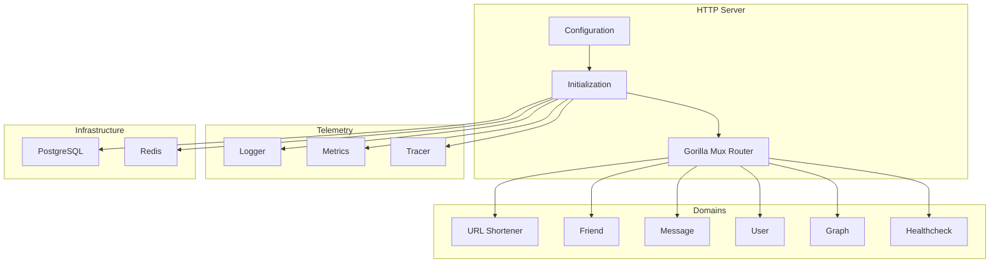
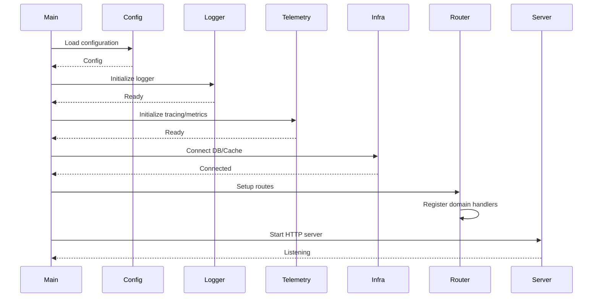

# HTTP Server

The HTTP Server is the entry point for HTTP requests.

## Architecture

## Startup Sequence

## Configuration

Environment variables (`.env`):

| Variable | Default | Description |
|----------|---------|-------------|
| `SERVER_PORT` | 5000 | HTTP server port |
| `BASE_URL` | https://short.est | Base URL for shortened links |
| `POSTGRES_HOST` | localhost | PostgreSQL host |
| `POSTGRES_PORT` | 5432 | PostgreSQL port |
| `REDIS_HOST` | localhost:6379 | Redis address |
| `SERVICE_NAME` | backend-app | Service identifier |
| `LOG_LEVEL` | INFO | Logging level |
| `LOG_FORMAT` | TEXT | Log format |
| `APP_TOKEN_TTL` | 24h | JWT token expiration |

## Related

- [infrastructure/http/README.md](HTTP Infrastructure)
- [infrastructure/http/middleware/README.md](HTTP Middleware)
- [[docs/request-flow.md|Request Flow]]
