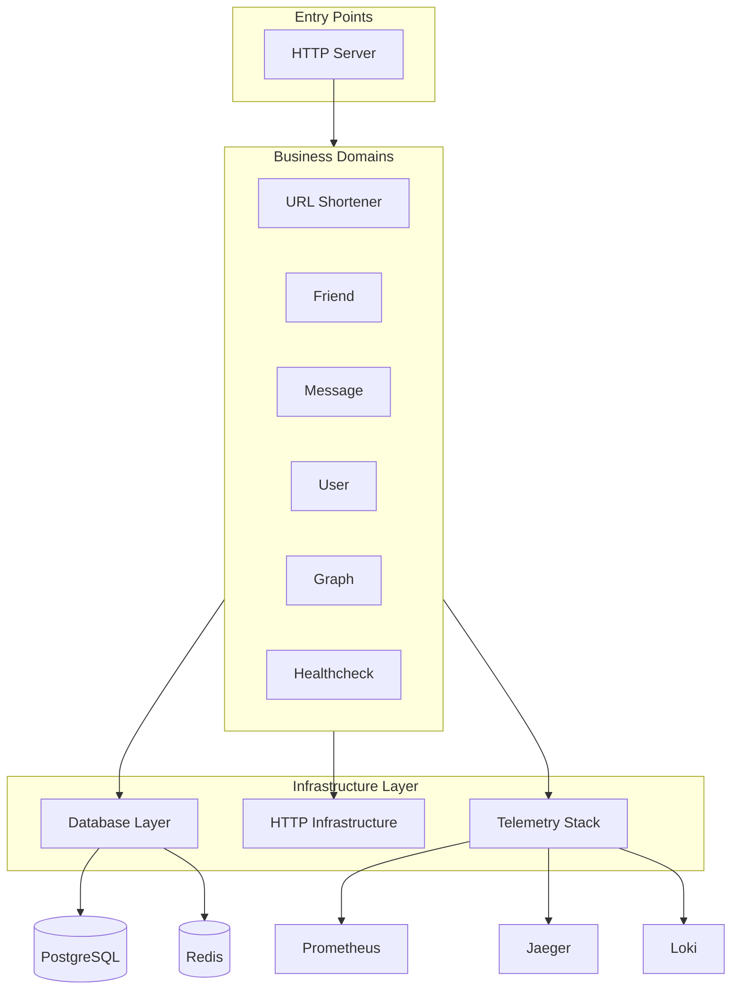

# Architecture Overview

The backend app follows a domain-driven modular architecture with clear separation of concerns.

## High-Level Structure

```
backend-app/
├── binary/     → HTTP Server - Entry points
├── domain/     → Business Domains - Business logic
├── infrastructure/ → Infrastructure Layer - Technical components
├── mock/       → Test Mocks - Test doubles
└── docs/       → Documentation
```

## Architecture Diagram



## Design Principles

1. **Domain Isolation** - Each domain is an independent bounded context
2. **Dependency Inversion** - Domains depend on abstractions, not concrete implementations
3. **Clear Layering** - Handler → Service → Repository pattern within domains
4. **Infrastructure Reuse** - Shared components across all domains
5. **Protocol Agnostic** - Business logic independent of transport protocol

## Related

- [[docs/code-structure.md|Code Structure]]
- [[docs/design-principles.md|Design Principles]]
- [[docs/request-flow.md|Request Flow]]
