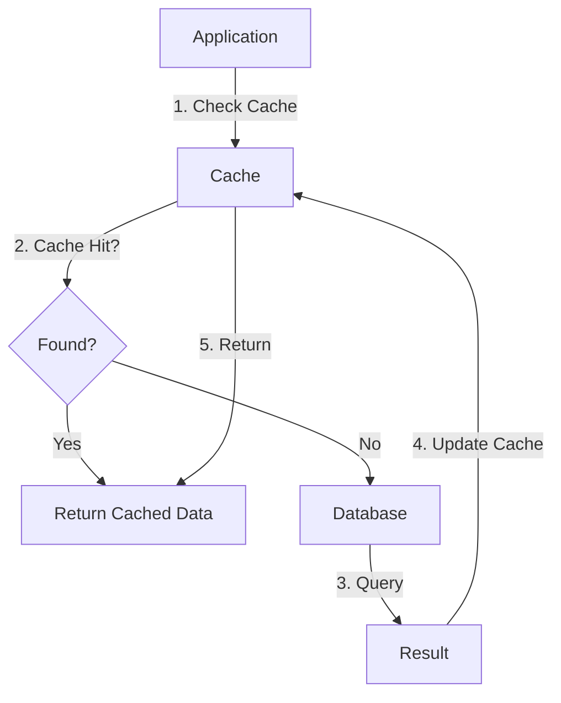
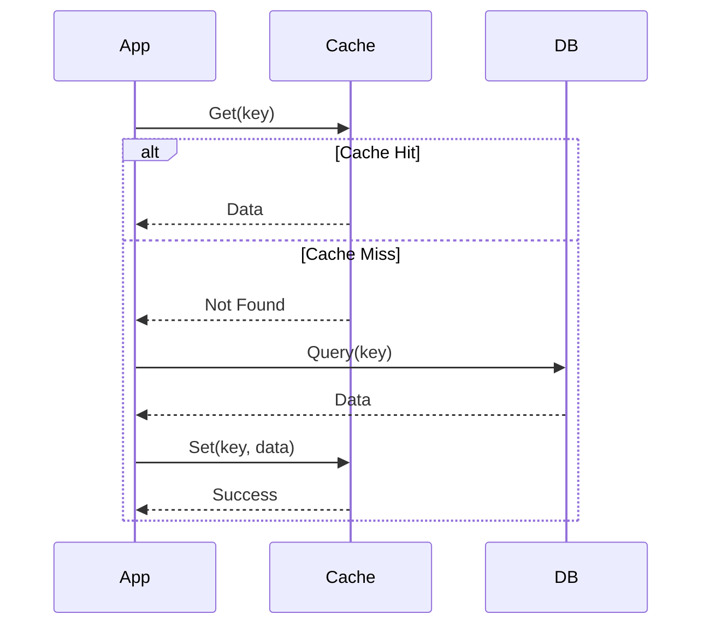

# Cache-Aside Pattern

The Cache-Aside Pattern is used for performance optimization.

## How It Works

## Request Flow

## Implementation

Used in URL Shortener:

1. Check cache for existing short code
2. On miss, query PostgreSQL
3. Update cache for next request

## Benefits

- Reduces database load
- Improves response time
- Scales read-heavy workloads

## Related

- [infrastructure/database/postgres/README.md](PostgreSQL Client)
- [infrastructure/database/redis/README.md](Redis Client)
- [[docs/request-flow.md|Request Flow]]
