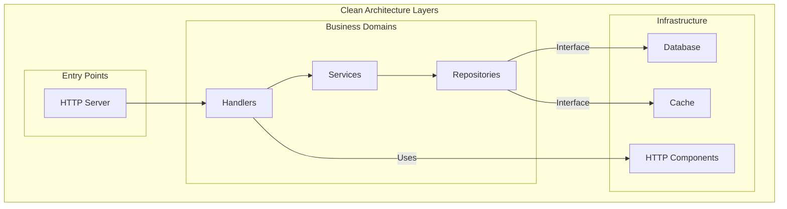
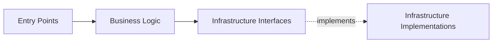

# Clean Architecture

Clean architecture principles guide the backend app structure.

## Layer Separation

## Dependency Rule

Dependencies point **inward**:

## Benefits

- Framework independent
- Testable
- UI independent
- Database independent
- External services independent

## Related

- [[docs/architecture-overview.md|Architecture Overview]]
- [[docs/dependency-inversion.md|Dependency Inversion]]
- [[docs/domain-driven-design.md|Domain-Driven Design]]
