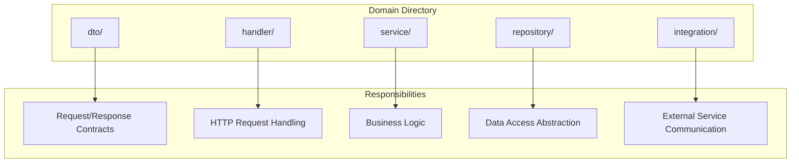

# Code Structure

The backend app codebase follows a consistent structure across all domains.

## Directory Layout

```
backend-app/
├── binary/
│   └── http/              → HTTP Server
├── domain/
│   ├── url-shortener/      → URL Shortener
│   ├── friend/             → Friend
│   ├── message/            → Message
│   ├── user/               → User
│   ├── graph/              → Graph
│   └── healthcheck/        → Healthcheck
├── infrastructure/
│   ├── database/           → Database Layer
│   ├── http/               → HTTP Infrastructure
│   └── telemetry/          → Telemetry Stack
├── mock/                   → Test Mocks
└── docs/                   → Documentation
```

## Standard Domain Pattern

Each domain follows this structure:



## Layer Responsibilities

| Layer | Directory | Responsibility |
|-------|-----------|----------------|
| Presentation | `handler/` | HTTP request handling, validation |
| Application | `service/` | Business logic, orchestration |
| Persistence | `repository/` | Data access abstraction |
| Contracts | `dto/` | Request/response definitions |
| Integration | `integration/` | External service clients |

## Related

- [[docs/architecture-overview.md|Architecture Overview]]
- [[docs/repository-pattern.md|Repository Pattern]]
- [[docs/clean-architecture.md|Clean Architecture]]
