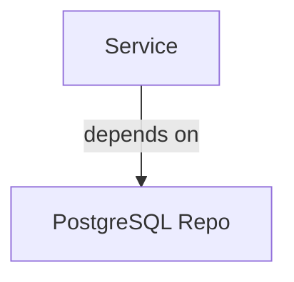
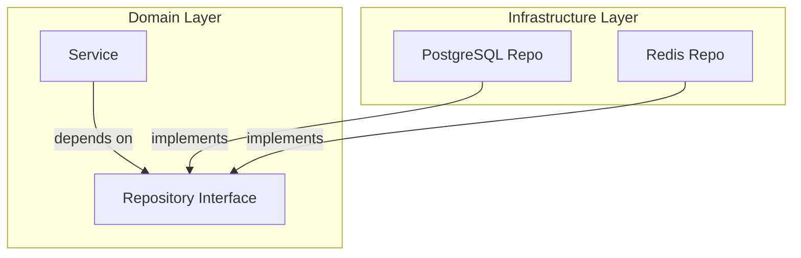

# Dependency Inversion Principle

The Dependency Inversion Principle ensures flexibility and testability.

## The Principle

- High-level modules should not depend on low-level modules
- Both should depend on abstractions
- Abstractions should not depend on details
- Details should depend on abstractions

## Before (Wrong Way)



## After (Right Way)



## Benefits

- Easy testing with [mock/README.md](mocks)
- Swap implementations without changing domain logic
- Clear contract between layers

## Example

```go
// Domain layer - depends on interface
type Service struct {
    repository Repository  // Interface, not concrete
}

// Infrastructure layer - implements interface
type PostgresRepository struct {
    db *sqlx.DB
}
```

## Related

- [[docs/repository-pattern.md|Repository Pattern]]
- [[docs/clean-architecture.md|Clean Architecture]]
- [mock/README.md](Test Mocks)
