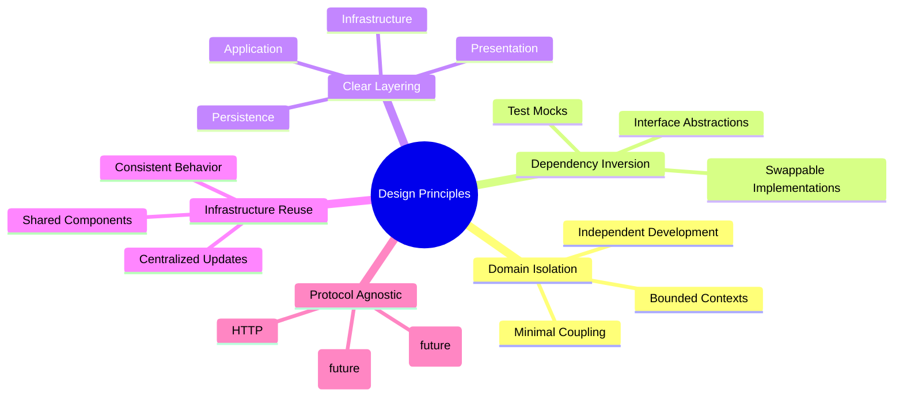
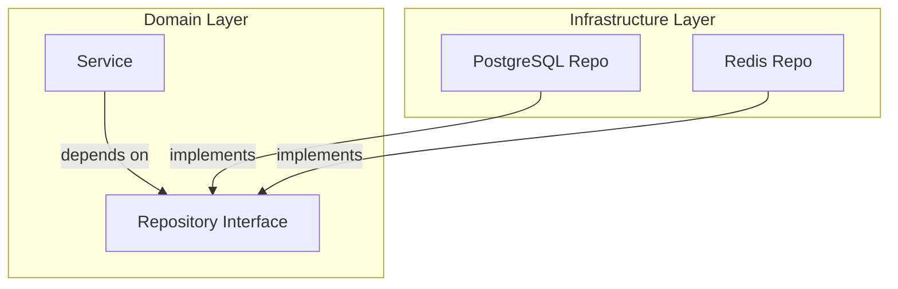

# Design Principles

The backend app follows these core design principles to maintain a clean, maintainable codebase.

## Principles Overview

## 1. Domain Isolation

Each domain is a bounded context with clear boundaries.

### Benefits

- Clear ownership
- Reduced cognitive load
- Easier testing
- Parallel development

### Example

- URL Shortener doesn't need to know about Friend
- User doesn't need to know about Message
- Each domain can evolve independently

## 2. Dependency Inversion

High-level modules don't depend on low-level modules. Both depend on abstractions.

### Implementation

## 3. Clear Layering

Each component has a single, well-defined responsibility.

### Layers

## 4. Infrastructure Reuse

Technical components are shared across all domains.

### Shared Components

- HTTP Middleware
- Database Clients
- Telemetry Stack
- Response Utilities

## 5. Protocol Agnostic

Business logic is independent of the transport protocol.

### Benefits

- Can add new protocols without changing business logic
- Services can be reused across different entry points
- Easier testing of business logic

## Related

- [[docs/architecture-overview.md|Architecture Overview]]
- [[docs/code-structure.md|Code Structure]]
- [[docs/clean-architecture.md|Clean Architecture]]
