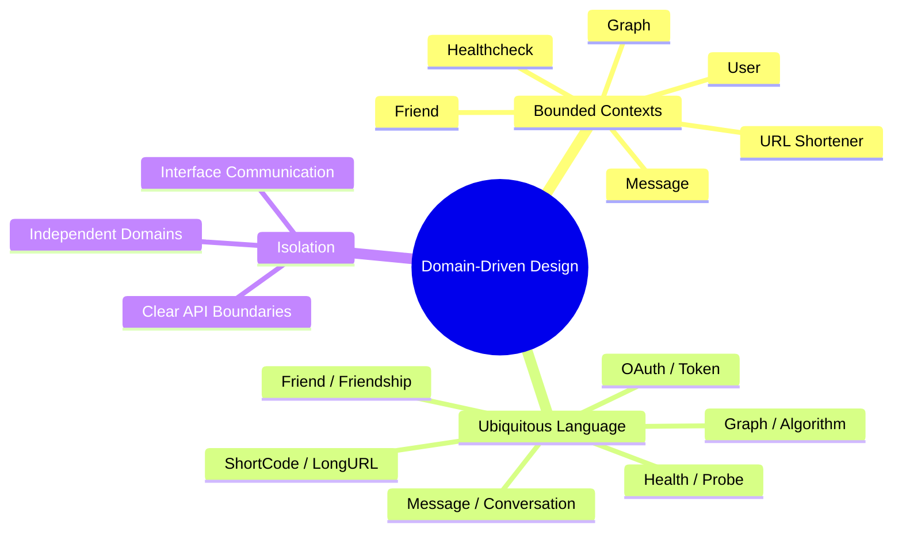

# Domain-Driven Design

Domain-Driven Design is the foundational design pattern for the backend app.

## Key Concepts

## Bounded Contexts

Each domain represents a bounded context:

| Domain        | Context        | Language                                |
| ------------- | -------------- | --------------------------------------- |
| URL Shortener | URL management | `ShortCode`, `LongURL`, `Mapping`       |
| Friend        | Relationships  | `FriendConnection`, `Friendship`        |
| Message       | Conversations  | `Message`, `Conversation`               |
| User          | Authentication | `OAuth`, `Token`, `User`                |
| Graph         | Algorithms     | `Graph`, `Vertex`, `Edge`, `DFS`, `BFS` |
| Healthcheck   | Monitoring     | `Health`, `Probe`, `Liveness`           |

## Ubiquitous Language

Each domain has its own vocabulary:

### URL Shortener
- `ShortCode` - The generated short identifier
- `LongURL` - The original URL
- `Mapping` - The association between short code and long URL

### Friend
- `FriendConnection` - A friendship between users
- `Friendship` - The relationship state

### Message
- `Message` - A single message
- `Conversation` - A collection of messages

## Isolation Benefits

- Clear ownership boundaries
- Independent development
- Easier testing
- Reduced coupling

## Related

- [[docs/clean-architecture.md|Clean Architecture]]
- [[docs/architecture-overview.md|Architecture Overview]]
- [[docs/repository-pattern.md|Repository Pattern]]
