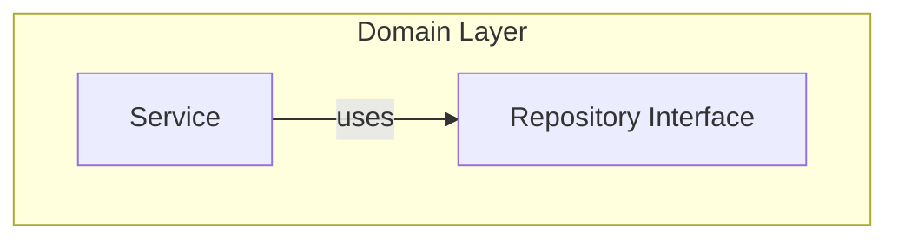
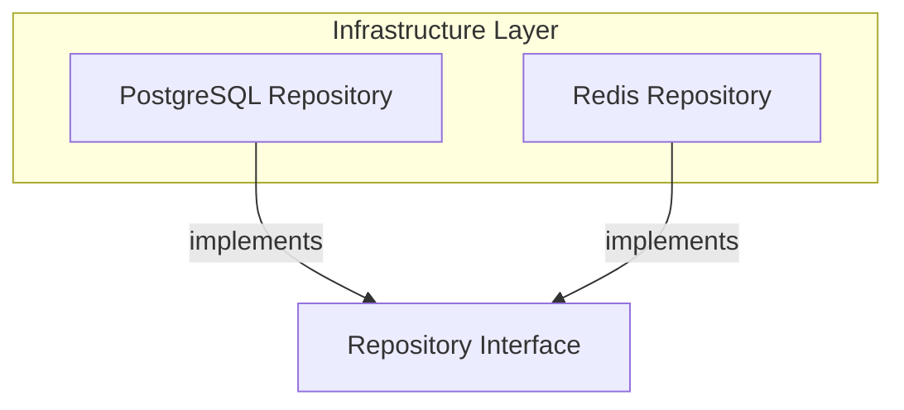
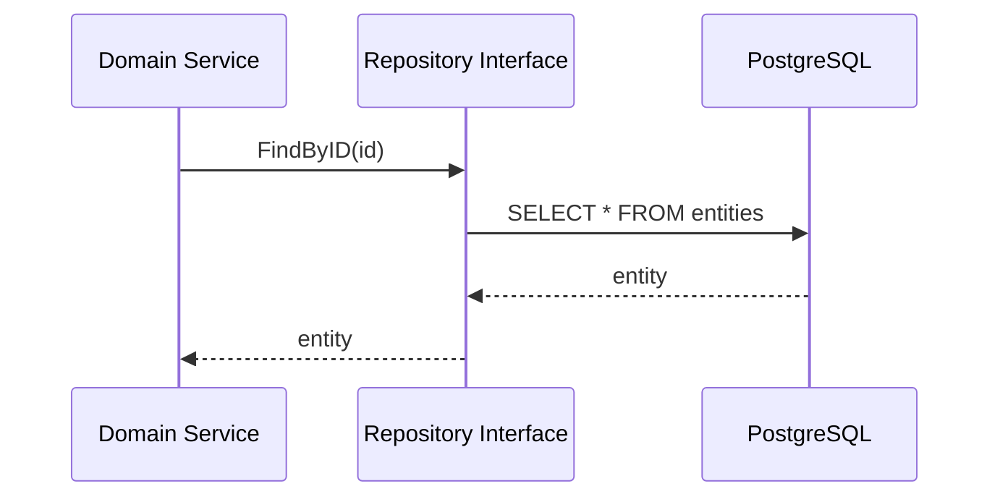

# Repository Pattern

The Repository Pattern abstracts data access in the backend app.

## Purpose

- Separate domain logic from data access
- Enable easy testing through mocking
- Allow swapping storage implementations

## Implementation

### Interface (Domain Layer)



### Implementation (Infrastructure Layer)



## Example Interface

```go
type Repository interface {
    FindByID(ctx context.Context, id string) (*Entity, error)
    FindAll(ctx context.Context) ([]*Entity, error)
    Save(ctx context.Context, entity *Entity) error
    Delete(ctx context.Context, id string) error
}
```

## Usage



## Benefits

- Easy testing with [mock/README.md](mocks)
- Swappable implementations
- Clear contract between layers

## Related

- [[docs/dependency-inversion.md|Dependency Inversion]]
- [domain/url-shortener/README.md](Domain Services)
- [mock/README.md](Test Mocks)
