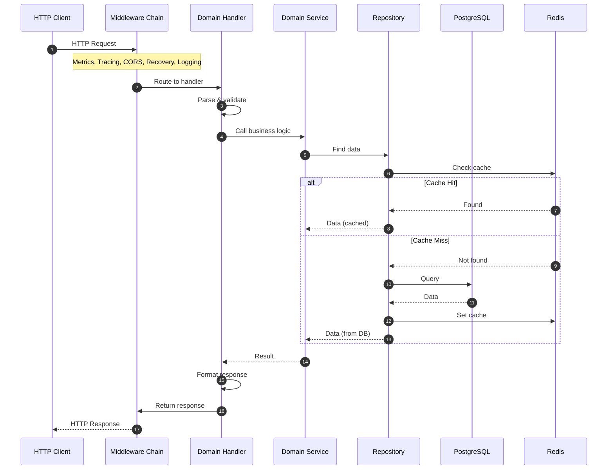
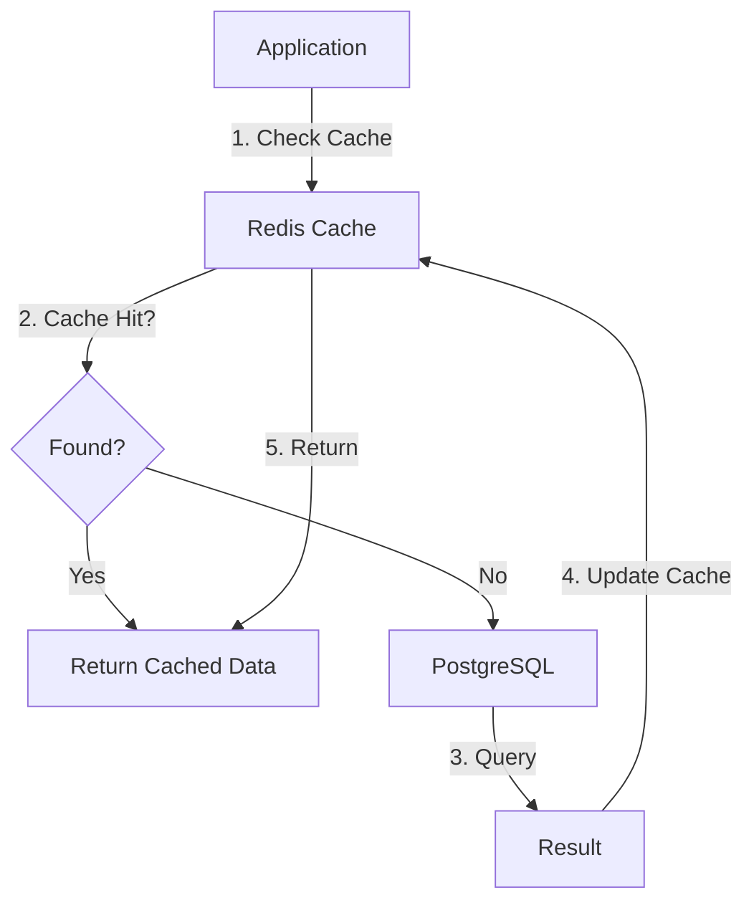

# Request Flow

The request flow shows how an HTTP request travels through the architecture.

## Request Lifecycle

## Middleware Chain

```mermaid
flowchart LR
    Request[Incoming Request] --> Metrics[Metrics]
    Metrics --> Tracing[Tracing]
    Tracing --> CORS[CORS]
    CORS --> Recovery[Recovery]
    Recovery --> Logging[Logging]
    Logging --> ContentType[Content-Type]
    ContentType --> ResponseTime[Response Time]
    ResponseTime --> Handler[Domain Handler]
    Handler --> Response[Outgoing Response]
```

## Cache-Aside Flow

For URL Shortener requests:

## Related

- [[docs/architecture-overview.md|Architecture Overview]]
- [infrastructure/http/middleware/README.md](HTTP Middleware)
- [[docs/cache-aside-pattern.md|Cache-Aside Pattern]]
