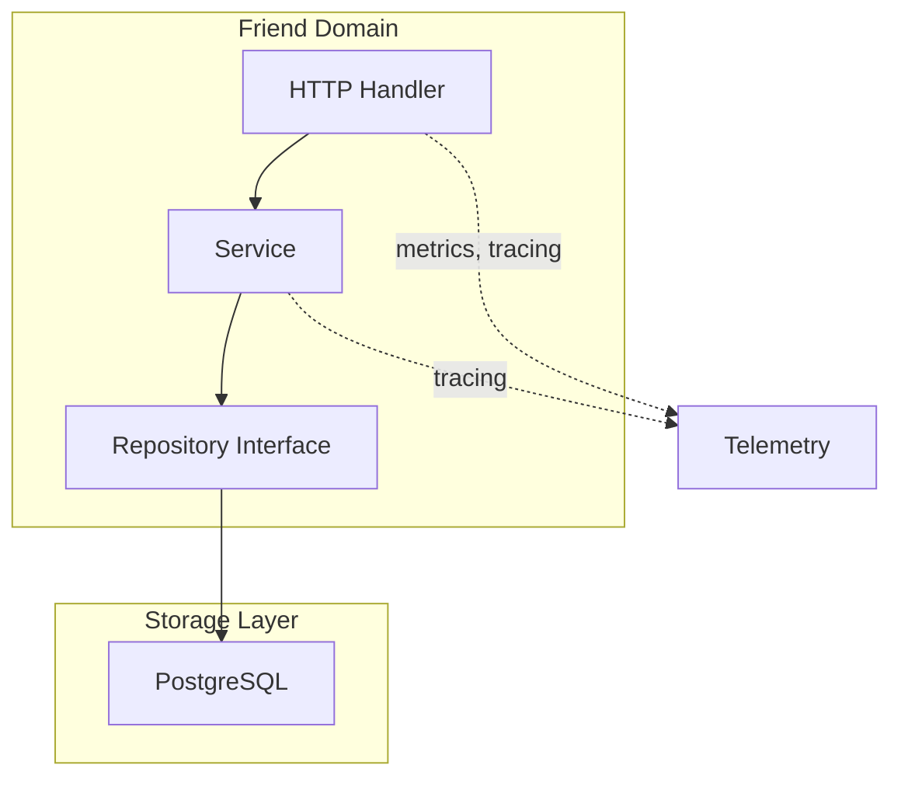
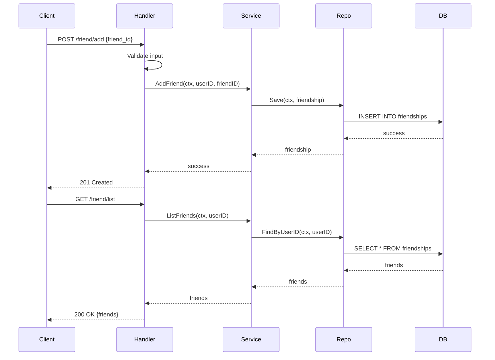

# Friend Domain

The Friend domain manages user friendship relationships.

## Purpose

Add, remove, and list friend connections between users.

## Architecture

## Storage

- **Primary**: [infrastructure/database/postgres/README.md](PostgreSQL) - Friend relationships

## Components

| Component | Location | Responsibility |
|-----------|-----------|----------------|
| DTO | `dto/` | Friend data structures |
| Handler | `handler/` | HTTP request handling |
| Service | `service/` | Friend business logic |
| Repository | `repository/` | Friend data access |

## Request Flow

## Endpoints

| Method | Endpoint | Description |
|--------|----------|-------------|
| POST | `/friend/add` | Add friend |
| DELETE | `/friend/remove` | Remove friend |
| GET | `/friend/list` | List user's friends |

## Features

- Add friend connections
- Remove friend connections
- List user's friends

## Related

- [[docs/repository-pattern.md|Repository Pattern]]
- [[domain/url-shortener/README.md|Domain Services]]
