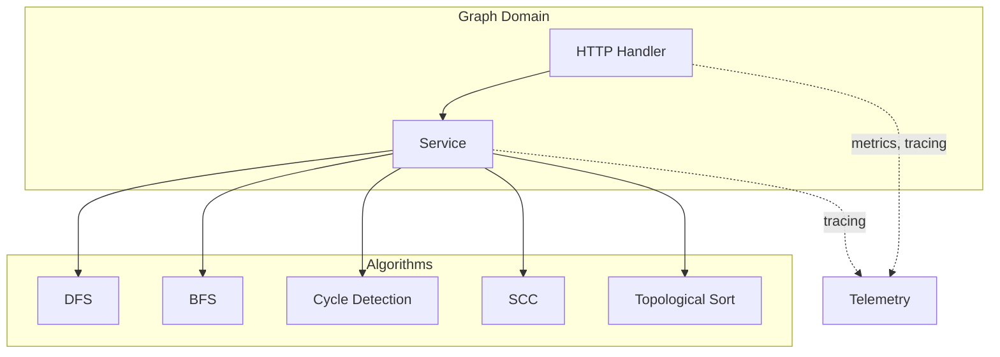
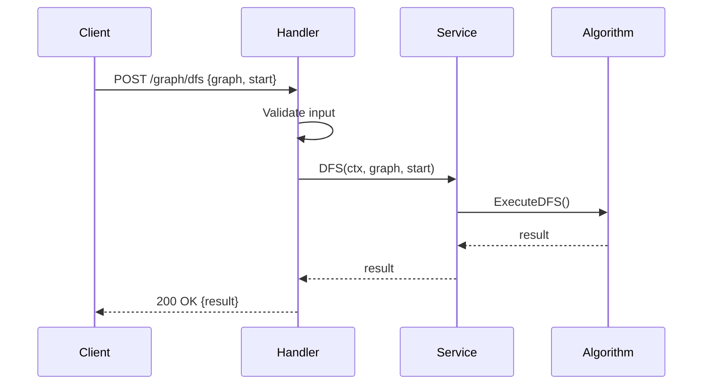

# Graph Domain

The Graph domain provides graph algorithm implementations.

## Purpose

Expose common graph algorithms as HTTP endpoints.

## Architecture

## Storage

- **None**: Pure algorithms, no database dependency

## Components

| Component | Location | Responsibility |
|-----------|-----------|----------------|
| DTO | `dto/` | Graph data structures |
| Handler | `handler/` | HTTP request handling |
| Service | `service/` | Algorithm implementations |

## Algorithms

| Algorithm | Description | Complexity |
|------------|-------------|-------------|
| DFS | Depth-First Search | O(V + E) |
| BFS | Breadth-First Search | O(V + E) |
| Cycle Detection | Detect cycles in graph | O(V + E) |
| SCC | Strongly Connected Components | O(V + E) |
| Articulation Points | Find critical vertices | O(V + E) |
| Eulerian Paths | Paths using each edge once | O(V + E) |
| Topological Sort | Linear order in DAG | O(V + E) |

## Request Flow

## Endpoints

| Method | Endpoint | Description |
|--------|----------|-------------|
| POST | `/graph/dfs` | Depth-First Search |
| POST | `/graph/bfs` | Breadth-First Search |
| POST | `/graph/cycle` | Detect cycles |
| POST | `/graph/scc` | Strongly Connected Components |
| POST | `/graph/articulation` | Articulation Points |
| POST | `/graph/eulerian` | Eulerian Paths |
| POST | `/graph/topological` | Topological Sort |

## Related

- Domain Services
- Graph Algorithms
