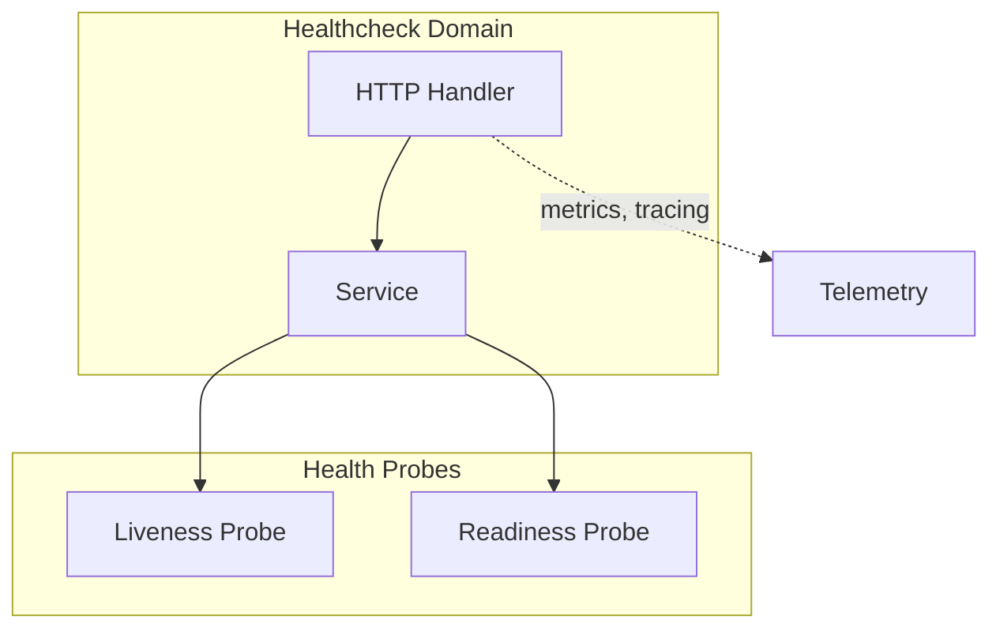
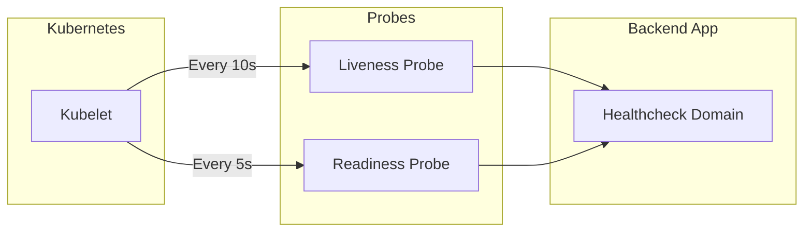

# Healthcheck Domain

The Healthcheck domain provides service health monitoring.

## Purpose

Expose endpoints for Kubernetes liveness and readiness probes.

## Architecture



## Storage

- **None**: Simple health checks

## Components

| Component | Location | Responsibility |
|-----------|-----------|----------------|
| Handler | `handler/` | HTTP request handling |
| Service | `service/` | Health check logic |

## Endpoints

| Method | Endpoint | Description |
|--------|----------|-------------|
| GET | `/health/live` | Liveness probe |
| GET | `/health/ready` | Readiness probe |

## Kubernetes Probes



### Liveness Probe

- **Endpoint**: `GET /health/live`
- **Purpose**: Restart container if unresponsive
- **Configuration**:
  ```yaml
  livenessProbe:
    httpGet:
      path: /health/live
      port: 5000
    initialDelaySeconds: 10
    periodSeconds: 10
  ```

### Readiness Probe

- **Endpoint**: `GET /health/ready`
- **Purpose**: Stop routing traffic if not ready
- **Configuration**:
  ```yaml
  readinessProbe:
    httpGet:
      path: /health/ready
      port: 5000
    initialDelaySeconds: 5
    periodSeconds: 5
  ```

## Related

- [infrastructure/http/README.md](HTTP Handlers)
- [infrastructure/telemetry/README.md](Telemetry Stack)
- Kubernetes Probes
