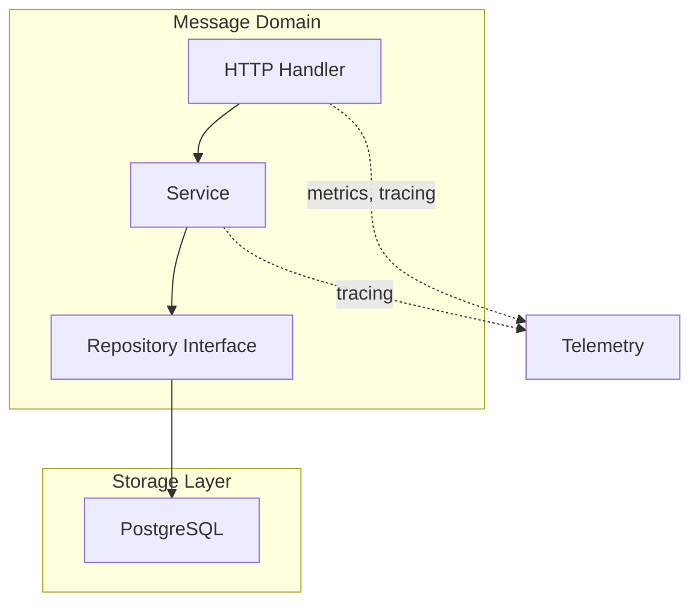
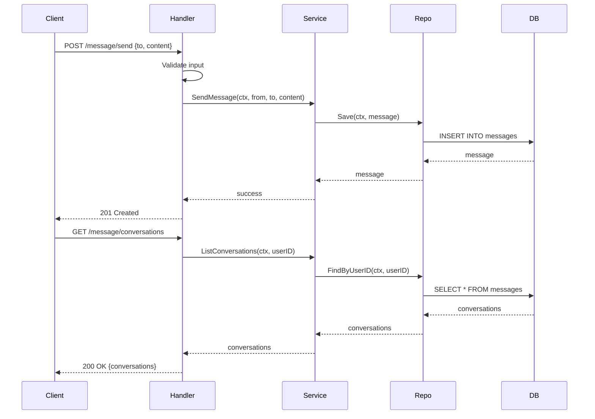

# Message Domain

The Message domain handles conversation storage and retrieval.

## Purpose

Store and retrieve messages between users.

## Architecture

## Storage

- **Primary**: [infrastructure/database/postgres/README.md](PostgreSQL) - Messages and conversations

## Components

| Component | Location | Responsibility |
|-----------|-----------|----------------|
| DTO | `dto/` | Message data structures |
| Handler | `handler/` | HTTP request handling |
| Service | `service/` | Message business logic |
| Repository | `repository/` | Message data access |

## Request Flow

## Endpoints

| Method | Endpoint | Description |
|--------|----------|-------------|
| POST | `/message/send` | Send message |
| GET | `/message/conversations` | List conversations |
| GET | `/message/{conversation_id}` | Get conversation history |

## Features

- Send messages
- Retrieve conversation history
- List user conversations

## Related

- [[docs/repository-pattern.md|Repository Pattern]]
- [[domain/url-shortener/README.md|Domain Services]]
