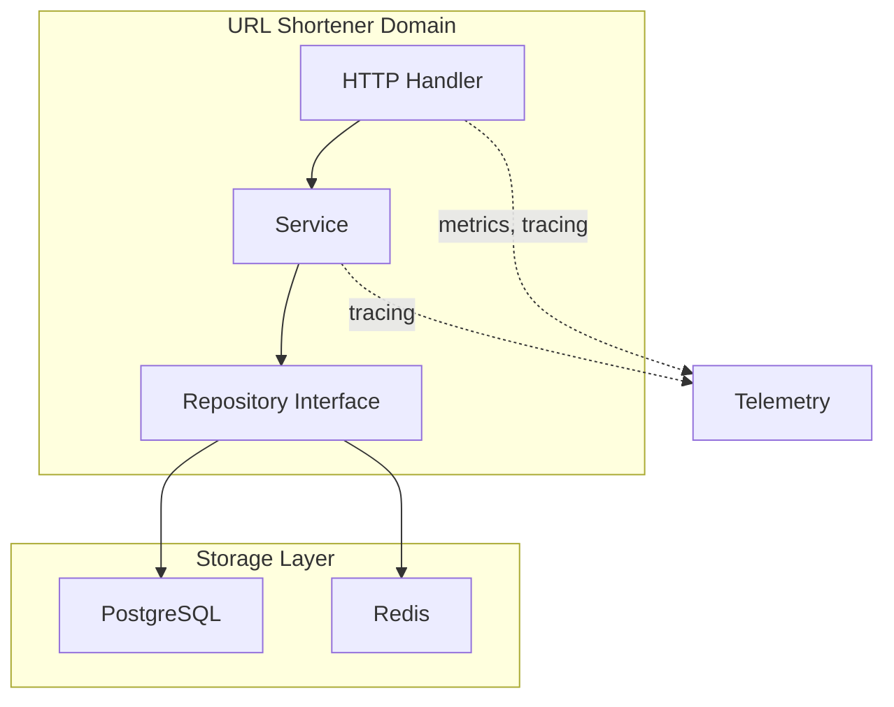
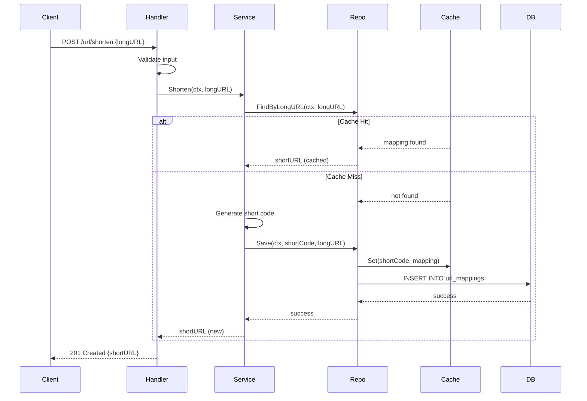

# URL Shortener Domain

The URL Shortener domain handles URL shortening and expansion functionality.

## Purpose

Convert long URLs into short, shareable codes and redirect back to the original URLs.

## Architecture

## Storage

- **Primary**: [infrastructure/database/postgres/README.md](PostgreSQL) - Persistent storage for URL mappings
- **Cache**: [infrastructure/database/redis/README.md](Redis) - Cache-aside pattern for performance

## Components

| Component | Location | Responsibility |
|-----------|-----------|----------------|
| DTO | `dto/` | Request/response contracts |
| Handler | `handler/` | HTTP request handling |
| Service | `service/` | Business logic |
| Repository | `repository/` | Data access abstraction |

## Request Flow

## Endpoints

| Method | Endpoint | Description |
|--------|----------|-------------|
| POST | `/url/shorten` | Create short URL |
| GET | `/url/{shortCode}` | Redirect to original URL |

## Features

- SHA256-based short code generation
- Cache-first lookup for performance
- 301 permanent redirects
- Duplicate URL detection

## Related

- [[docs/repository-pattern.md|Repository Pattern]]
- [[docs/cache-aside-pattern.md|Cache-Aside Pattern]]
- [[docs/request-flow.md|Request Flow]]
- [[infrastructure/http/middleware/README.md|HTTP Middleware]]
