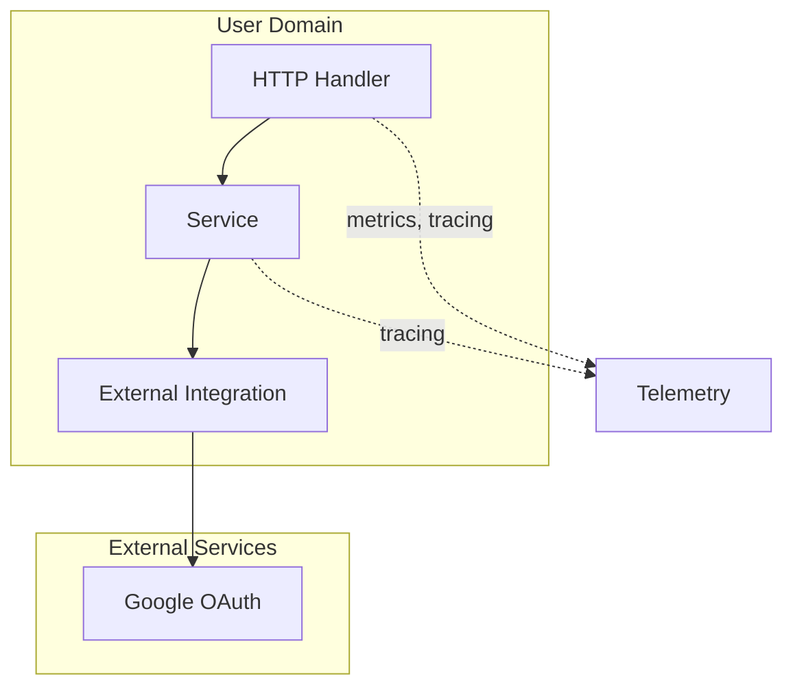
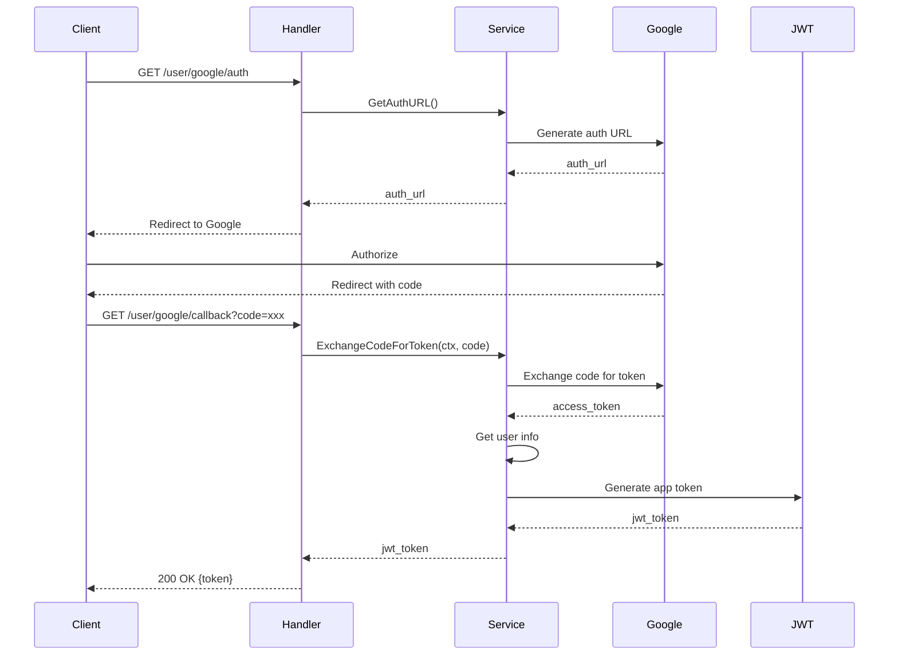

# User Domain

The User domain handles authentication and authorization.

## Purpose

Authenticate users using Google OAuth and issue JWT tokens.

## Architecture

## Storage

- **None**: Uses external OAuth provider

## Components

| Component | Location | Responsibility |
|-----------|-----------|----------------|
| DTO | `dto/` | User data structures |
| Handler | `handler/` | HTTP request handling |
| Service | `service/` | Authentication logic |
| Integration | `integration/` | Google OAuth client |

## OAuth Flow

## Endpoints

| Method | Endpoint | Description |
|--------|----------|-------------|
| GET | `/user/google/auth` | Start OAuth flow |
| GET | `/user/google/callback` | OAuth callback |
| POST | `/user/token/validate` | Validate JWT token |

## Features

- Google OAuth 2.0 authentication
- JWT token generation
- Token validation
- Configurable token TTL

## Related

- OAuth 2.0
- JWT Authentication
- External Integrations
