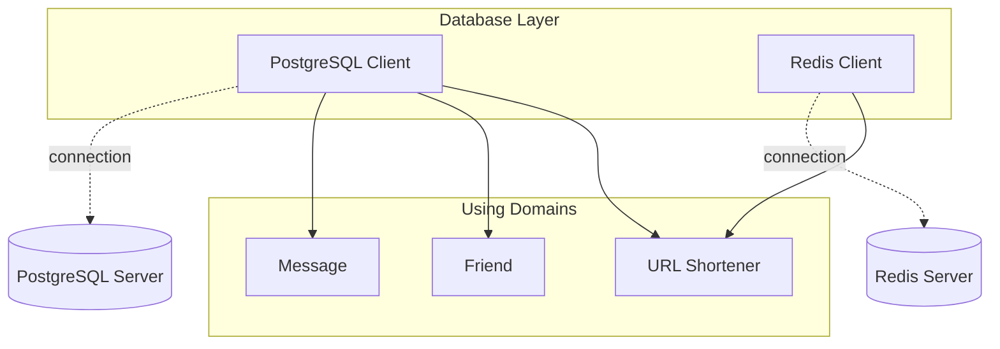

# Database Layer

The Database Layer provides database clients and connection management.

## Architecture

## Components

| Component | Location | Purpose |
|-----------|-----------|---------|
| PostgreSQL Client | `postgres/` | PostgreSQL connectivity |
| Redis Client | `redis/` | Redis connectivity |
| Migrations | `migration/` | Schema versioning |

## Features

- Connection pooling
- Health checking
- Query execution
- Transaction support
- Cache-first lookups

## Related

- [infrastructure/database/postgres/README.md](PostgreSQL Client)
- [infrastructure/database/redis/README.md](Redis Client)
- [[docs/repository-pattern.md|Repository Pattern]]
