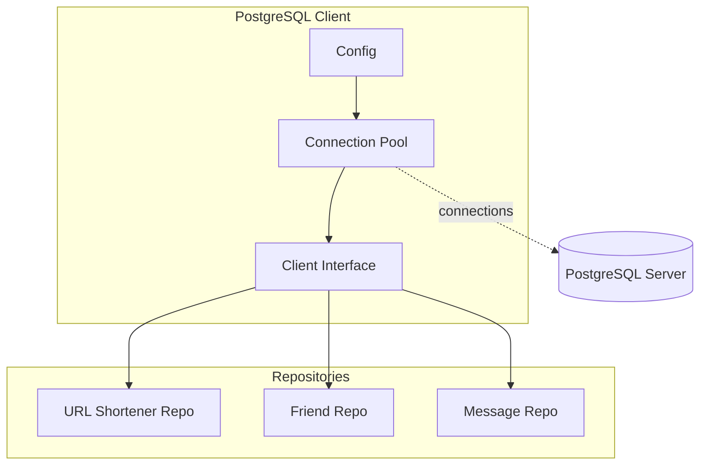

# PostgreSQL Client

The PostgreSQL Client provides PostgreSQL database connectivity.

## Architecture



## Features

- Connection pooling via `sqlx`
- Query execution
- Transaction support
- Health checking

## Usage

```go
type Client interface {
    Query(ctx context.Context, query string, args ...any) (*sqlx.Rows, error)
    QueryRow(ctx context.Context, query string, args ...any) *sqlx.Row
    Exec(ctx context.Context, query string, args ...any) (sql.Result, error)
}
```

## Used By

- [domain/url-shortener/README.md](URL Shortener) - URL mappings
- [domain/friend/README.md](Friend) - Friend relationships
- [domain/message/README.md](Message) - Messages

## Related

- [infrastructure/database/README.md](Database Layer)
- [[docs/cache-aside-pattern.md|Cache-Aside Pattern]]
- [[docs/repository-pattern.md|Repository Interface]]
