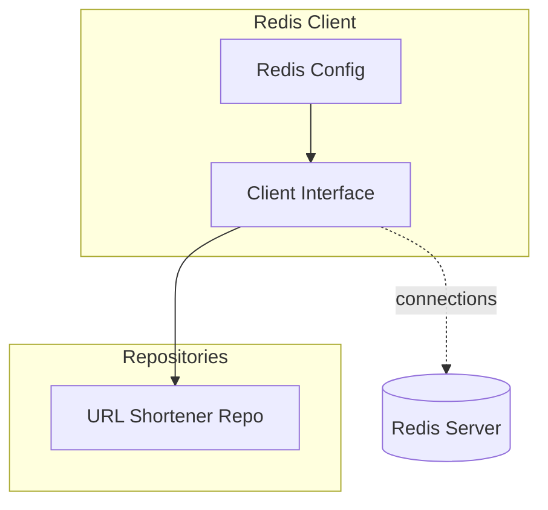
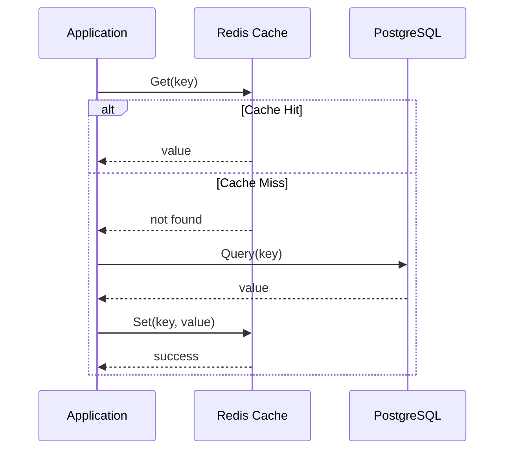

# Redis Client

The Redis Client provides Redis cache connectivity.

## Architecture



## Features

- Get/Set operations
- Health checking (ping)
- Expiration handling
- Connection pooling

## Cache-Aside Pattern



## Usage

```go
type Client interface {
    Get(ctx context.Context, key string) (string, error)
    Set(ctx context.Context, key string, value interface{}, expiration time.Duration) error
    Del(ctx context.Context, keys ...string) error
}
```

## Used By

- [domain/url-shortener/README.md](URL Shortener) - URL mapping cache

## Related

- [infrastructure/database/README.md](Database Layer)
- [[docs/cache-aside-pattern.md|Cache-Aside Pattern]]
- [infrastructure/database/postgres/README.md](PostgreSQL Client)
