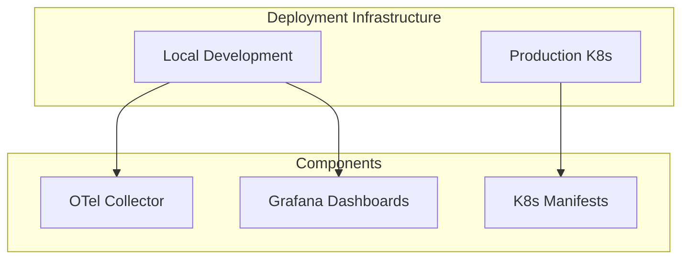

# Deployment Infrastructure

The Deployment Infrastructure handles local and production deployment.

## Architecture



## Local Development

### Docker Compose

Services:
- OTel Collector (4317/4318)
- Jaeger UI (16686)
- Prometheus (9090)
- Grafana (3000)
- Loki (3100)
- PostgreSQL (5432)
- Redis (6379)

### Start

```bash
cd infrastructure/instance/local
make start
```

## Production

### Kubernetes Manifests

- Deployments
- Services
- ConfigMaps
- Secrets

Location: `infrastructure/deploymnet/deployments/`

## Related

- [binary/http/README.md](HTTP Server)
- [infrastructure/telemetry/README.md](Telemetry Stack)
