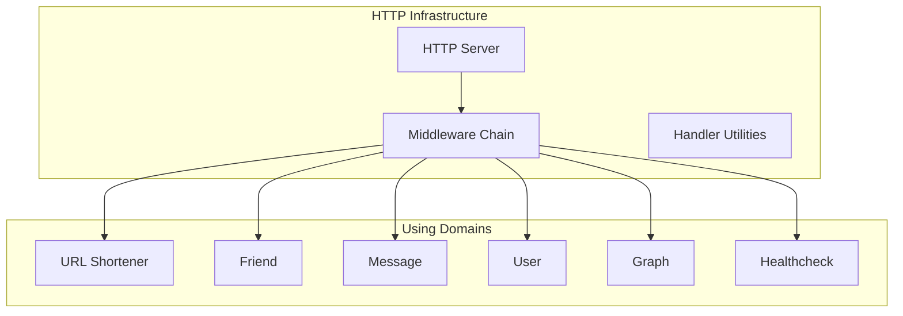
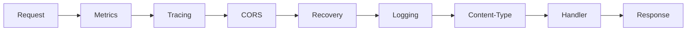

# HTTP Infrastructure

The HTTP Infrastructure provides HTTP server and middleware components.

## Architecture

## Components

| Component | Location | Purpose |
|-----------|-----------|---------|
| HTTP Server | `server.go` | Server configuration |
| Middleware | `middleware/` | Cross-cutting HTTP concerns |
| Handler Utils | `handler/` | Shared response utilities |

## Middleware Chain

## Middleware Order

| Order | Middleware | Purpose |
|--------|------------|---------|
| 1 | Metrics | Record request count/latency |
| 2 | Tracing | Create distributed trace spans |
| 3 | CORS | Handle cross-origin requests |
| 4 | Recovery | Panic recovery |
| 5 | Logging | Request/response logging |
| 6 | Content-Type | Enforce JSON |

## Related

- [binary/http/README.md](HTTP Server)
- [infrastructure/http/middleware/README.md](HTTP Middleware)
- [domain/url-shortener/README.md](HTTP Handlers)
