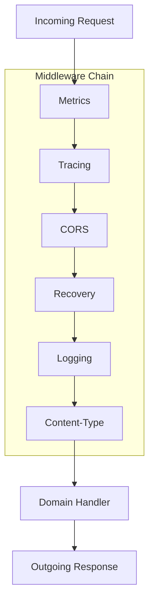

# HTTP Middleware

The HTTP Middleware provides cross-cutting concerns for the HTTP layer.

## Architecture



## Middleware Functions

### Metrics Middleware

- **Purpose**: Record request count and latency
- **Records**:
  - `http_requests_total`: Request count by method, route, status
  - `http_request_duration_seconds`: Request latency

### Tracing Middleware

- **Purpose**: Create distributed trace spans
- **Context**: Propagates trace context across requests

### CORS Middleware

- **Purpose**: Handle cross-origin requests
- **Headers**:
  - `Access-Control-Allow-Origin`
  - `Access-Control-Allow-Methods`
  - `Access-Control-Allow-Headers`

### Recovery Middleware

- **Purpose**: Panic recovery
- **Behavior**: Returns 500 Internal Error on panic

### Logging Middleware

- **Purpose**: Request/response logging
- **Logs**: Method, path, status, duration

### Content-Type Middleware

- **Purpose**: Enforce JSON content type
- **Headers**: `Content-Type: application/json`

## Usage

```go
urlShortenerChain := infraHttp.Chain(
    infraHttp.ResponseTimeMiddleware,
    infraHttp.ContentTypeMiddleware,
    infraHttp.RecoveryMiddleware,
    infraHttp.LoggingMiddleware,
    infraHttp.CORSMiddleware,
    infraHttp.TracingMiddleware("url-shortener"),
)
```

## Related

- [infrastructure/http/README.md](HTTP Infrastructure)
- [infrastructure/telemetry/metrics/README.md](Metrics Collection)
- [infrastructure/telemetry/span/README.md](Distributed Tracing)
