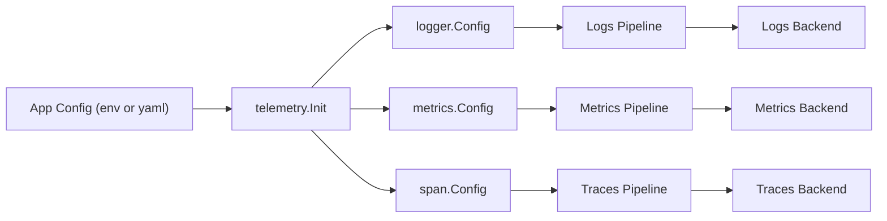
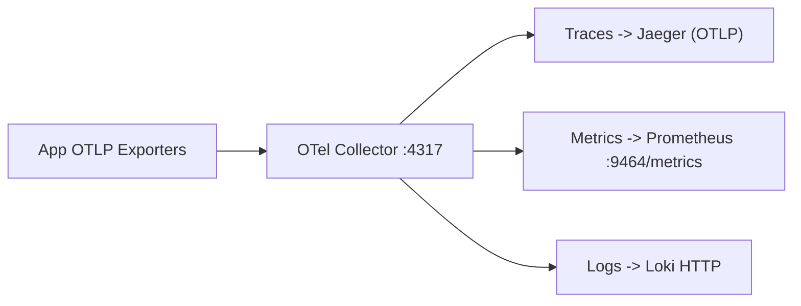
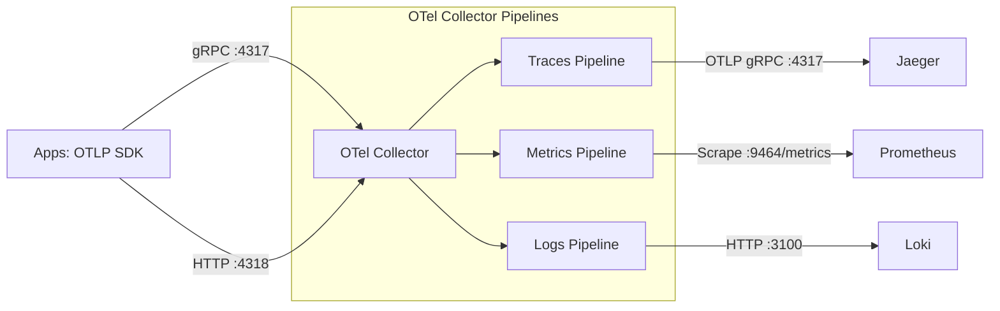

# Telemetry Configuration

This document defines a **single, app-level configuration** that drives logs, metrics, and traces for services using the telemetry package.

## Local Instance: Spawn OTel Collector

Use the local instance in this folder to run only the OTel Collector with OTLP receivers enabled.

### Files

- `otel-collector.yaml` — collector configuration (receivers, processors, exporters).
- `docker-compose.yaml` — local runner for the collector.

### Start / Stop

```zsh
cd /Users/m.syamsularifin/go/portofolio/backend-app/infrastructure/instance/local/otel-collector
make start
```

```zsh
make stop
```

### Network Test (Inside Compose)

This compose file includes a `network-test` service that checks:

- OTLP gRPC `otel-collector:4317`
- OTLP HTTP `otel-collector:4318`
- Prometheus scrape `otel-collector:9464/metrics`

View output:

```zsh
docker compose logs -f network-test
```

### Exposed Ports

- `4317` — OTLP gRPC receiver (apps export here)
- `4318` — OTLP HTTP receiver
- `9464` — Prometheus scrape endpoint (collector)

### Quick Verify

```zsh
nc -zv localhost 4317
curl -sS http://localhost:9464/metrics | head -n 20
```

## Goals

- One place to set **service identity**, **collector endpoint**, and **environment**.
- Consistent defaults across logs, metrics, and spans.
- Easy override using **env vars** (recommended for deployment).

## Configuration Diagram



## Environment Variables (Recommended)

| Variable | Type | Default | Description |
|----------|------|---------|-------------|
| `OTEL_SERVICE_NAME` | string | **required** | Service name, appears as `service.name`. |
| `OTEL_COLLECTOR_ENDPOINT` | string | `localhost:4317` | OTLP gRPC endpoint for logs/metrics/traces. |
| `OTEL_ENVIRONMENT` | string | `development` | Deployment environment: `development` or `production`. |
| `OTEL_INSECURE` | bool | `true` (dev), `false` (prod) | Use insecure OTLP transport. |
| `OTEL_LOGS_ENABLED` | bool | `true` | Export logs via OTLP in addition to console. |
| `OTEL_LOG_LEVEL` | string | `info` | Log level: `debug`, `info`, `warn`, `error`. |
| `OTEL_LOG_FORMAT` | string | `text` (dev), `json` (prod) | Console output format. |
| `OTEL_METRICS_INTERVAL` | duration | `15s` (dev), `30s` (prod) | Metrics export interval. |
| `OTEL_TRACE_SAMPLE_RATE` | float | `1.0` (dev), `0.1` (prod) | Trace sampling ratio (0-1). |

## Example `.env`

```env
OTEL_SERVICE_NAME=user-service
OTEL_COLLECTOR_ENDPOINT=otel-collector:4317
OTEL_ENVIRONMENT=production
OTEL_INSECURE=false
OTEL_LOGS_ENABLED=true
OTEL_LOG_LEVEL=info
OTEL_LOG_FORMAT=json
OTEL_METRICS_INTERVAL=30s
OTEL_TRACE_SAMPLE_RATE=0.1
```

## Example `config.yaml`

```yaml
telemetry:
  serviceName: user-service
  collectorEndpoint: otel-collector:4317
  environment: production
  insecure: false

  logs:
    enabled: true
    level: info
    format: json

  metrics:
    pushInterval: 30s

  traces:
    sampleRate: 0.1
```

## Mapping to Telemetry Clients

| App Config Field | logger.Config | metrics.Config | span.Config |
|------------------|---------------|----------------|-------------|
| `serviceName` | `ServiceName` | `ServiceName` | `ServiceName` |
| `collectorEndpoint` | `CollectorEndpoint` | `CollectorEndpoint` | `CollectorEndpoint` |
| `environment` | `Environment` | `Environment` | `Environment` |
| `insecure` | `Insecure` | `Insecure` | `Insecure` |
| `logs.enabled` | `LogsEnabled` | - | - |
| `logs.level` | `Level` | - | - |
| `logs.format` | `Format` | - | - |
| `metrics.pushInterval` | - | `PushInterval` | - |
| `traces.sampleRate` | - | - | `SampleRate` |

## Recommended Defaults

- **Development:** `insecure=true`, `log.format=text`, `metrics.interval=15s`, `trace.sampleRate=1.0`
- **Production:** `insecure=false`, `log.format=json`, `metrics.interval=30s`, `trace.sampleRate=0.1`

## Collector Strategy

A **single OTel Collector** is recommended for all signals. Use separate pipelines inside the collector config for logs, metrics, and traces. Split collectors only if you need isolation or different scaling per signal.

## Collector Configuration (Jaeger + Prometheus + Loki)

Use this file as a ready-to-run collector configuration:

- File: `backend-app/infrastructure/telemetry/otel-collector.yaml`
- OTLP gRPC receiver: `:4317`
- OTLP HTTP receiver: `:4318`
- Prometheus scrape endpoint: `:9464/metrics`



### Configuration Walkthrough

The collector config in `otel-collector.yaml` is split into four main blocks. Each block maps directly to how signals move through the collector.

#### 1) Receivers (Ingress)

```yaml
receivers:
  otlp:
    protocols:
      grpc:
        endpoint: 0.0.0.0:4317
      http:
        endpoint: 0.0.0.0:4318
```

- **OTLP gRPC :4317** — primary endpoint used by your Go SDK exporters.
- **OTLP HTTP :4318** — optional endpoint for HTTP-based exporters or testing.

#### 2) Processors (Buffering & Safety)

```yaml
processors:
  batch: {}
  memory_limiter:
    check_interval: 5s
    limit_mib: 256
```

- **memory_limiter** prevents OOM under load.
- **batch** groups signals to reduce network overhead.

#### 3) Exporters (Egress)

```yaml
exporters:
  otlp/jaeger:
    endpoint: jaeger:4317
    tls:
      insecure: true
  prometheus:
    endpoint: 0.0.0.0:9464
  loki:
    endpoint: http://loki:3100/loki/api/v1/push
```

- **Jaeger (OTLP gRPC :4317)** receives traces from the collector.
- **Prometheus (scrape :9464/metrics)** pulls metrics from the collector.
- **Loki (HTTP :3100)** receives logs via push.

#### 4) Pipelines (Signal Routing)

```yaml
service:
  pipelines:
    traces:
      receivers: [otlp]
      processors: [memory_limiter, batch]
      exporters: [otlp/jaeger, logging]
    metrics:
      receivers: [otlp]
      processors: [memory_limiter, batch]
      exporters: [prometheus, logging]
    logs:
      receivers: [otlp]
      processors: [memory_limiter, batch]
      exporters: [loki, logging]
```

- Each signal has its own **pipeline**.
- Same OTLP receiver feeds all three pipelines.
- `logging` exporter is enabled for debugging.

### Detailed Diagram (Ports Included)



### Example Start Command

```zsh
docker run --rm -p 4317:4317 -p 4318:4318 -p 9464:9464 \
  -v "$PWD/backend-app/infrastructure/telemetry/otel-collector.yaml:/etc/otelcol/config.yaml" \
  otel/opentelemetry-collector-contrib:latest \
  --config=/etc/otelcol/config.yaml
```

### Prometheus Scrape Config

```yaml
scrape_configs:
  - job_name: "otel-collector"
    static_configs:
      - targets: ["otel-collector:9464"]
```

## Verify Endpoints (Quick Checklist)

```zsh
# Collector OTLP gRPC (should accept connections)
nc -zv localhost 4317

# Collector OTLP HTTP (should return 404 or OK depending on route)
curl -sS http://localhost:4318 | head -n 5

# Prometheus scrape endpoint (should show metrics)
curl -sS http://localhost:9464/metrics | head -n 20
```

```zsh
# Loki readiness (optional)
curl -sS http://localhost:3100/ready

# Jaeger query UI (optional)
open http://localhost:16686
```

## Env Wiring Example (Go)

```go
package telemetrycfg

import (
  "os"
  "strconv"
  "time"

  "github.com/msyamsula/portofolio/backend-app/infrastructure/telemetry/logger"
  "github.com/msyamsula/portofolio/backend-app/infrastructure/telemetry/metrics"
  "github.com/msyamsula/portofolio/backend-app/infrastructure/telemetry/span"
)

func envOrDefault(key, def string) string {
  if v := os.Getenv(key); v != "" {
    return v
  }
  return def
}

func envBool(key string, def bool) bool {
  if v := os.Getenv(key); v != "" {
    b, err := strconv.ParseBool(v)
    if err == nil {
      return b
    }
  }
  return def
}

func envFloat(key string, def float64) float64 {
  if v := os.Getenv(key); v != "" {
    f, err := strconv.ParseFloat(v, 64)
    if err == nil {
      return f
    }
  }
  return def
}

func envDuration(key string, def time.Duration) time.Duration {
  if v := os.Getenv(key); v != "" {
    d, err := time.ParseDuration(v)
    if err == nil {
      return d
    }
  }
  return def
}

func envLogLevel(key string, def logger.Level) logger.Level {
  switch envOrDefault(key, "") {
  case "debug":
    return logger.DebugLevel
  case "info":
    return logger.InfoLevel
  case "warn":
    return logger.WarnLevel
  case "error":
    return logger.ErrorLevel
  default:
    return def
  }
}

func envLogFormat(key string, def logger.Format) logger.Format {
  switch envOrDefault(key, "") {
  case "json":
    return logger.JSONFormat
  case "text":
    return logger.TextFormat
  default:
    return def
  }
}

func LoggerConfig() logger.Config {
  env := envOrDefault("OTEL_ENVIRONMENT", "development")
  prod := env == "production"
  return logger.Config{
    ServiceName:       envOrDefault("OTEL_SERVICE_NAME", "app"),
    CollectorEndpoint: envOrDefault("OTEL_COLLECTOR_ENDPOINT", "localhost:4317"),
    Insecure:          envBool("OTEL_INSECURE", !prod),
    Environment:       env,
    LogsEnabled:       envBool("OTEL_LOGS_ENABLED", true),
    Level:             envLogLevel("OTEL_LOG_LEVEL", logger.InfoLevel),
    Format:            envLogFormat("OTEL_LOG_FORMAT", func() logger.Format {
      if prod {
        return logger.JSONFormat
      }
      return logger.TextFormat
    }()),
  }
}

func MetricsConfig() metrics.Config {
  env := envOrDefault("OTEL_ENVIRONMENT", "development")
  prod := env == "production"
  return metrics.Config{
    ServiceName:       envOrDefault("OTEL_SERVICE_NAME", "app"),
    CollectorEndpoint: envOrDefault("OTEL_COLLECTOR_ENDPOINT", "localhost:4317"),
    Insecure:          envBool("OTEL_INSECURE", !prod),
    Environment:       env,
    PushInterval:      envDuration("OTEL_METRICS_INTERVAL", func() time.Duration {
      if prod {
        return 30 * time.Second
      }
      return 15 * time.Second
    }()),
  }
}

func SpanConfig() span.Config {
  env := envOrDefault("OTEL_ENVIRONMENT", "development")
  prod := env == "production"
  return span.Config{
    ServiceName:       envOrDefault("OTEL_SERVICE_NAME", "app"),
    CollectorEndpoint: envOrDefault("OTEL_COLLECTOR_ENDPOINT", "localhost:4317"),
    Insecure:          envBool("OTEL_INSECURE", !prod),
    Environment:       env,
    SampleRate:        envFloat("OTEL_TRACE_SAMPLE_RATE", func() float64 {
      if prod {
        return 0.1
      }
      return 1.0
    }()),
  }
}
```
