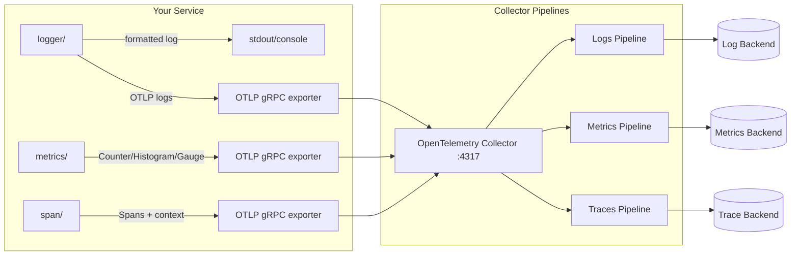
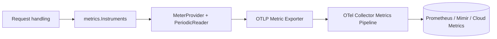
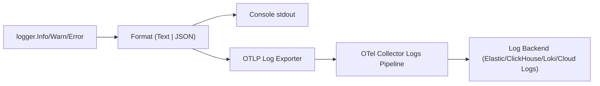
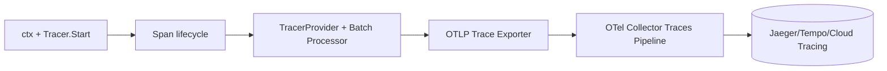
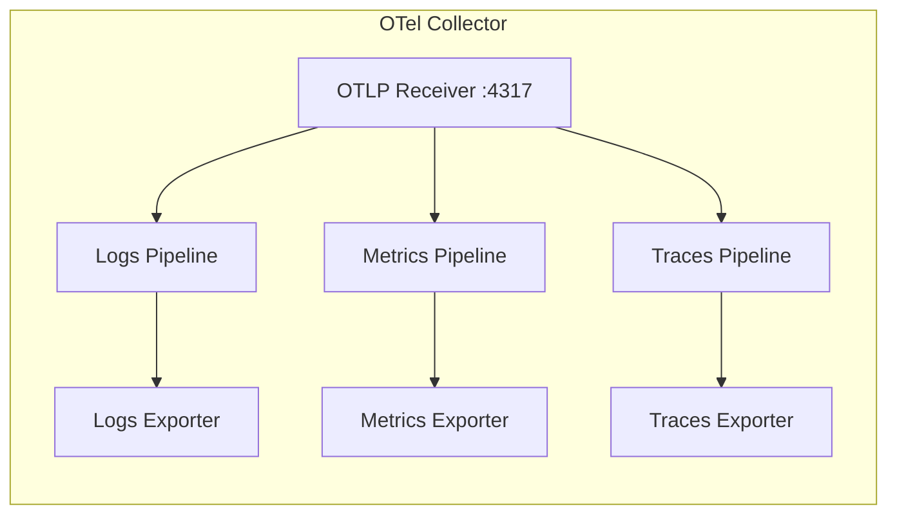

# Telemetry Package Documentation

This package provides OpenTelemetry instrumentation for Go microservices, with separate, self-contained components for metrics, distributed tracing, and structured logging.

## Overview

The telemetry package is organized into independent components:

| Package | Purpose |
|---------|---------|
| **`metrics/`** | Metrics collection with Counter, Histogram, Gauge instruments |
| **`span/`** | Distributed tracing with span creation |
| **`logger/`** | Structured logging (console + OTLP export) |
| **`otel.go`** | Configuration helpers for common settings |

Each package is **self-contained** with its own `NewClient()` function and can be used independently without depending on a unified client.

## Quick Start

### Basic Initialization

```go
package main

import (
    "context"
    "log"
    "net/http"

    "github.com/msyamsula/portofolio/backend-app/infrastructure/telemetry/logger"
    "github.com/msyamsula/portofolio/backend-app/infrastructure/telemetry/metrics"
    "github.com/msyamsula/portofolio/backend-app/infrastructure/telemetry/span"
)

func main() {
    ctx := context.Background()

    // Initialize each telemetry component independently
    loggerClient, err := logger.NewClient(ctx, logger.Config{
        ServiceName:       "my-service",
        CollectorEndpoint: "localhost:4317",
        Insecure:          true,
        Environment:       "development",
        LogsEnabled:       true,   // Enable OTLP export
        Level:             logger.InfoLevel,
        Format:            logger.TextFormat,
    })
    if err != nil {
        log.Fatal(err)
    }
    defer loggerClient.Shutdown(ctx)

    metricsClient, err := metrics.NewClient(ctx, metrics.Config{
        ServiceName:       "my-service",
        CollectorEndpoint: "localhost:4317",
        Insecure:          true,
        PushInterval:      15 * time.Second,
        Environment:       "development",
    })
    if err != nil {
        log.Fatal(err)
    }
    defer metricsClient.Shutdown(ctx)

    spanClient, err := span.NewClient(ctx, span.Config{
        ServiceName:       "my-service",
        CollectorEndpoint: "localhost:4317",
        Insecure:          true,
        SampleRate:        1.0,  // 100% sampling
        Environment:       "development",
    })
    if err != nil {
        log.Fatal(err)
    }
    defer spanClient.Shutdown(ctx)

    // Use the clients
    http.HandleFunc("/", handleRequest(loggerClient, metricsClient, spanClient))
    http.ListenAndServe(":8080", nil)
}
```

## Configuration

### Using Config Helpers

The `otel.go` package provides configuration helpers:

```go
import "github.com/msyamsula/portofolio/backend-app/infrastructure/telemetry"

// Default config for development
cfg := telemetry.DefaultConfig("my-service")

// Production config
cfg := telemetry.ProductionConfig("my-service", "otel-collector.prod.example.com:4317")

// Convert to package-specific configs
loggerCfg := cfg.ToLoggerConfig()
loggerClient, err := logger.NewClient(ctx, loggerCfg)
```

### Configuration Options

| Option | Description | Default |
|--------|-------------|---------|
| `ServiceName` | Name of your service | Required |
| `CollectorEndpoint` | OTLP collector address | `localhost:4317` |
| `Insecure` | Use insecure connection | `true` (dev), `false` (prod) |
| `Environment` | Deployment environment | `development` / `production` |
| `LogsEnabled` | Enable OTLP log export | `true` |
| `MetricsPushInterval` | Metrics export frequency | `15s` (dev), `30s` (prod) |
| `TraceSampleRate` | Trace sampling (0-1) | `1.0` (dev), `0.1` (prod) |

## Metrics

### Understanding Metric Instruments

OpenTelemetry provides three main types of metric instruments:

#### 1. Counter

A **Counter** is a cumulative value that only increases (never decreases). Use counters for things that count occurrences.

**Use cases:**
- Number of HTTP requests received
- Number of errors occurred
- Number of items processed
- Number of user signups

**Example:**
```go
counter, _ := meter.Int64Counter(
    "http_requests_total",
    metric.WithDescription("Total number of HTTP requests"),
    metric.WithUnit("1"),
)

// Increment the counter
counter.Add(ctx, 1, metric.WithAttributes(
    attribute.String("method", "GET"),
    attribute.String("path", "/api/users"),
    attribute.Int("status", 200),
))
```

#### 2. Histogram

A **Histogram** collects values and counts them in configurable buckets. Use histograms for measuring values like durations, sizes, or amounts.

**Use cases:**
- HTTP request duration
- Database query duration
- Response size in bytes
- Order values in USD

**Example:**
```go
durationHistogram, _ := meter.Float64Histogram(
    "http_request_duration_seconds",
    metric.WithDescription("HTTP request duration in seconds"),
    metric.WithUnit("s"),
)

// Record a duration value
durationHistogram.Record(ctx, 0.042, metric.WithAttributes(
    attribute.String("endpoint", "/api/users"),
))
```

#### 3. Gauge

A **Gauge** represents a point-in-time value that can go up or down. Unlike counters and histograms, gauges are **observable** and require a callback function to provide the current value.

**Use cases:**
- Current number of active users
- Current memory usage
- Current queue size
- Current temperature

**Example:**
```go
// Gauges are more complex - they require a callback
// This is typically done during initialization
```

### Using Predefined Instruments

The `metrics` package provides common HTTP instruments:

```go
import (
    "github.com/msyamsula/portofolio/backend-app/infrastructure/telemetry/metrics"
    "go.opentelemetry.io/otel/attribute"
)

// Get meter from metrics client
meter := metricsClient.Meter("my-service")

// Create predefined instruments
instruments, err := metrics.NewInstruments(meter)
if err != nil {
    log.Fatal(err)
}

// Record HTTP request (counter + duration together)
instruments.RecordRequest(ctx, "GET", "/api/users", 200, 0.042)

// Increment just the counter
instruments.IncrementRequestCounter(ctx, "POST", "/api/orders", 201)

// Record a custom duration
attrs := []attribute.KeyValue{
    attribute.String("operation", "database_query"),
    attribute.String("table", "users"),
}
instruments.RecordDuration(ctx, "db_query", 0.125, attrs...)
```

### Available Predefined Instruments

| Instrument | Type | Description |
|------------|------|-------------|
| `RequestCounter` | Counter | Total HTTP requests |
| `RequestDuration` | Histogram | HTTP request duration in seconds |
| `ActiveUsersGauge` | Gauge | Active users (reserved for future use) |

### Creating Custom Metrics

```go
import (
    "go.opentelemetry.io/otel/attribute"
    "go.opentelemetry.io/otel/metric"
)

meter := metricsClient.Meter("my-service")

// Custom counter for business events
eventsCounter, _ := meter.Int64Counter(
    "business_events_total",
    metric.WithDescription("Total business events"),
    metric.WithUnit("1"),
)
eventsCounter.Add(ctx, 1, metric.WithAttributes(
    attribute.String("event_type", "order_placed"),
    attribute.String("status", "success"),
))

// Custom histogram for order values
orderValueHistogram, _ := meter.Float64Histogram(
    "order_value_usd",
    metric.WithDescription("Order value in USD"),
    metric.WithUnit("USD"),
)
orderValueHistogram.Record(ctx, 99.99, metric.WithAttributes(
    attribute.String("currency", "USD"),
))
```

## Tracing (Spans)

### Creating Spans

```go
import (
    "go.opentelemetry.io/otel/attribute"
    "go.opentelemetry.io/otel/codes"
    tracer "github.com/msyamsula/portofolio/backend-app/infrastructure/telemetry/span"
)

// Get tracer from span client
otelTracer := spanClient.Tracer("my-service")

// Create a root span
ctx, span := otelTracer.Start(ctx, "process-order")
defer span.End()

// Add attributes to the span
span.SetAttributes(
    attribute.String("order.id", "order-123"),
    attribute.String("user.id", "user-456"),
    attribute.Float64("order.value", 99.99),
)

// Add an event to the span
span.AddEvent("payment-processed", trace.WithAttributes(
    attribute.String("payment.method", "credit_card"),
))

// Set span status
span.SetStatus(codes.Ok, "Order processed successfully")
```

### Nested Spans

```go
func processOrder(ctx context.Context, spanClient *span.Client) error {
    tracer := spanClient.Tracer("order-service")

    // Parent span
    ctx, parentSpan := tracer.Start(ctx, "process-order")
    defer parentSpan.End()

    // Nested span for validation
    if err := validateOrder(ctx, tracer); err != nil {
        parentSpan.RecordError(err)
        parentSpan.SetStatus(codes.Error, "validation failed")
        return err
    }

    // Nested span for payment
    if err := processPayment(ctx, tracer); err != nil {
        parentSpan.RecordError(err)
        parentSpan.SetStatus(codes.Error, "payment failed")
        return err
    }

    parentSpan.SetStatus(codes.Ok, "Order processed")
    return nil
}

func validateOrder(ctx context.Context, tracer trace.Tracer) error {
    ctx, span := tracer.Start(ctx, "validate-order")
    defer span.End()
    // validation logic...
    return nil
}

func processPayment(ctx context.Context, tracer trace.Tracer) error {
    ctx, span := tracer.Start(ctx, "process-payment")
    defer span.End()
    // payment logic...
    return nil
}
```

## Logging

### Basic Logging

The logger package provides structured logging with both console output and optional OTLP export:

```go
import "github.com/msyamsula/portofolio/backend-app/infrastructure/telemetry/logger"

// Console logging (always available)
loggerClient.Logger.Info("Server starting", map[string]any{
    "port": 8080,
    "env":  "production",
})

loggerClient.Logger.Error("Failed to process request", map[string]any{
    "request_id": "req-123",
})

loggerClient.Logger.WarnError("High latency detected", err, map[string]any{
    "duration_ms":  500,
    "endpoint":     "/api/users",
    "threshold_ms": 200,
})
```

### Log Levels

| Level | Usage |
|-------|-------|
| `Debug` | Detailed information for debugging |
| `Info` | General informational messages |
| `Warn` | Warning messages for potentially harmful situations |
| `Error` | Error messages for critical issues |

### Log Formats

#### Text Format (Development)

```go
loggerClient, _ := logger.NewClient(ctx, logger.Config{
    Level:  logger.InfoLevel,
    Format: logger.TextFormat,  // Human-readable
})
```

Output:
```
[2024-01-15T10:30:00Z][main.go:42]: Server starting, {"port":8080,"env":"production"}
```

#### JSON Format (Production)

```go
loggerClient, _ := logger.NewClient(ctx, logger.Config{
    Level:  logger.InfoLevel,
    Format: logger.JSONFormat,  // Machine-readable
})
```

Output:
```json
{"time":"2024-01-15T10:30:00Z","level":"INFO","file":"main.go","line":42,"message":"Server starting","metadata":{"port":8080,"env":"production"}}
```

### OTLP Log Export

When `LogsEnabled: true`, all formatted logs are automatically exported via OTLP:

```go
loggerClient, _ := logger.NewClient(ctx, logger.Config{
    ServiceName:       "my-service",
    CollectorEndpoint: "localhost:4317",
    Insecure:          true,
    Environment:       "development",
    LogsEnabled:       true,  // Enable OTLP export
    Level:             logger.InfoLevel,
    Format:            logger.JSONFormat,
})

// This log goes to BOTH console AND OTLP collector
loggerClient.Logger.Info("User logged in", map[string]any{
    "user_id": "12345",
})
```

### Standalone Logger (Without OTLP)

```go
// For simple console logging without OTLP
log := logger.Default()
log.Info("Application started", nil)

// Or with custom config
log := logger.New(logger.ConsoleConfig{
    Level:      logger.DebugLevel,
    Format:     logger.JSONFormat,
    TimeFormat: time.RFC3339Nano,
})
```

## Initialization in Your Binary

### Recommended Pattern: Singleton Telemetry Manager

Create a telemetry package in your application to hold global clients:

```go
// pkg/telemetry/telemetry.go
package telemetry

import (
    "context"
    "sync"

    "github.com/msyamsula/portofolio/backend-app/infrastructure/telemetry/logger"
    "github.com/msyamsula/portofolio/backend-app/infrastructure/telemetry/metrics"
    "github.com/msyamsula/portofolio/backend-app/infrastructure/telemetry/span"
)

var (
    once       sync.Once
    loggerClient *logger.Client
    metricsClient *metrics.Client
    spanClient   *span.Client
)

// Init initializes all telemetry clients
func Init(ctx context.Context, serviceName, collectorEndpoint, environment string) error {
    var initErr error
    once.Do(func() {
        // Initialize logger
        loggerClient, initErr = logger.NewClient(ctx, logger.Config{
            ServiceName:       serviceName,
            CollectorEndpoint: collectorEndpoint,
            Insecure:          environment == "development",
            Environment:       environment,
            LogsEnabled:       true,
            Level:             logger.InfoLevel,
            Format:            func() logger.Format {
                if environment == "production" {
                    return logger.JSONFormat
                }
                return logger.TextFormat
            }(),
        })

        if initErr != nil {
            return
        }

        // Initialize metrics
        metricsClient, initErr = metrics.NewClient(ctx, metrics.Config{
            ServiceName:       serviceName,
            CollectorEndpoint: collectorEndpoint,
            Insecure:          environment == "development",
            PushInterval:      15 * time.Second,
            Environment:       environment,
        })

        if initErr != nil {
            return
        }

        // Initialize span
        spanClient, initErr = span.NewClient(ctx, span.Config{
            ServiceName:       serviceName,
            CollectorEndpoint: collectorEndpoint,
            Insecure:          environment == "development",
            SampleRate:        func() float64 {
                if environment == "production" {
                    return 0.1  // 10% sampling in prod
                }
                return 1.0  // 100% sampling in dev
            }(),
            Environment: environment,
        })
    })

    return initErr
}

// Shutdown closes all telemetry clients
func Shutdown(ctx context.Context) error {
    var errs []error

    if loggerClient != nil {
        if err := loggerClient.Shutdown(ctx); err != nil {
            errs = append(errs, err)
        }
    }

    if metricsClient != nil {
        if err := metricsClient.Shutdown(ctx); err != nil {
            errs = append(errs, err)
        }
    }

    if spanClient != nil {
        if err := spanClient.Shutdown(ctx); err != nil {
            errs = append(errs, err)
        }
    }

    if len(errs) > 0 {
        return fmt.Errorf("shutdown errors: %v", errs)
    }
    return nil
}

// Getters for clients
func Logger() *logger.Logger {
    return loggerClient.Logger
}

func MetricsClient() *metrics.Client {
    return metricsClient
}

func SpanClient() *span.Client {
    return spanClient
}
```

### Usage in main.go

```go
package main

import (
    "context"
    "log"
    "os"
    "os/signal"
    "syscall"

    "github.com/yourorg/yourapp/pkg/telemetry"
)

func main() {
    ctx := context.Background()

    // Initialize telemetry
    err := telemetry.Init(ctx, "my-service", "localhost:4317", "development")
    if err != nil {
        log.Fatal(err)
    }
    defer telemetry.Shutdown(ctx)

    // Your application code here
    telemetry.Logger().Info("Application starting", nil)

    // Graceful shutdown
    sigCh := make(chan os.Signal, 1)
    signal.Notify(sigCh, syscall.SIGINT, syscall.SIGTERM)
    <-sigCh
}
```

## Reusing Telemetry Across Packages

### Option 1: Global Singleton (Recommended)

Pass telemetry clients through a singleton pattern (shown above):

```go
// In any package
import "github.com/yourorg/yourapp/pkg/telemetry"

func ProcessUser(ctx context.Context, userID string) error {
    // Access clients directly
    tracer := telemetry.SpanClient().Tracer("user-service")
    ctx, span := tracer.Start(ctx, "process-user")
    defer span.End()

    telemetry.Logger().Info("Processing user", map[string]any{
        "user_id": userID,
    })

    // ... your logic
    return nil
}
```

### Option 2: Dependency Injection

Pass telemetry clients through dependencies:

```go
// In your service/handler package
type UserService struct {
    logger   *logger.Logger
    tracer   trace.Tracer
    meter    metric.Meter
}

func NewUserService(logger *logger.Logger, tracer trace.Tracer, meter metric.Meter) *UserService {
    return &UserService{
        logger: logger,
        tracer: tracer,
        meter:  meter,
    }
}

func (s *UserService) CreateUser(ctx context.Context, req CreateUserRequest) error {
    ctx, span := s.tracer.Start(ctx, "create-user")
    defer span.End()

    s.logger.Info("Creating user", map[string]any{
        "email": req.Email,
    })

    // ... your logic
    return nil
}
```

Initialize in main:

```go
func main() {
    // ... initialize clients

    userService := user.NewUserService(
        telemetry.Logger(),
        telemetry.SpanClient().Tracer("user-service"),
        telemetry.MetricsClient().Meter("user-service"),
    )

    // ... use userService
}
```

### Option 3: Context-Based (Advanced)

For more complex scenarios, you can store clients in context:

```go
type contextKey struct{}

func ContextWithClients(ctx context.Context, logger *logger.Logger, tracer trace.Tracer) context.Context {
    return context.WithValue(ctx, contextKey{}, struct {
        logger *logger.Logger
        tracer trace.Tracer
    }{logger, tracer})
}

func LoggerFromContext(ctx context.Context) *logger.Logger {
    if v, ok := ctx.Value(contextKey{}).(*logger.Logger); ok {
        return v
    }
    return nil
}
```

## HTTP Middleware Integration

### Complete Middleware Example

```go
package middleware

import (
    "net/http"
    "time"

    "go.opentelemetry.io/otel/attribute"
    "go.opentelemetry.io/otel/codes"
    trace "go.opentelemetry.io/otel/trace"

    "github.com/msyamsula/portofolio/backend-app/infrastructure/telemetry/logger"
    "github.com/msyamsula/portofolio/backend-app/infrastructure/telemetry/metrics"
    pkgtrace "github.com/msyamsula/portofolio/backend-app/infrastructure/telemetry/span"
)

func TelemetryMiddleware(
    loggerClient *logger.Client,
    metricsClient *metrics.Client,
    spanClient *pkgtrace.Client,
    instruments *metrics.Instruments,
) func(http.Handler) http.Handler {
    return func(next http.Handler) http.Handler {
        return http.HandlerFunc(func(w http.ResponseWriter, r *http.Request) {
            tracer := spanClient.Tracer("http-server").(trace.Tracer)

            // Start span
            ctx, span := tracer.Start(r.Context(), r.URL.Path,
                trace.WithAttributes(
                    attribute.String("http.method", r.Method),
                    attribute.String("http.url", r.URL.String()),
                    attribute.String("http.host", r.Host),
                    attribute.String("http.scheme", r.URL.Scheme),
                ),
            )
            defer span.End()

            // Wrap response writer
            rw := &responseWriter{ResponseWriter: w, status: 200}
            start := time.Now()

            // Call next handler
            next.ServeHTTP(rw, r.WithContext(ctx))

            // Calculate duration
            duration := time.Since(start).Seconds()

            // Record metrics
            instruments.RecordRequest(ctx, r.Method, r.URL.Path, rw.status, duration)

            // Set span status and attributes
            span.SetAttributes(
                attribute.Int("http.status_code", rw.status),
                attribute.Float64("http.duration_ms", duration*1000),
            )

            if rw.status >= 400 {
                span.SetStatus(codes.Error, "request failed")
                loggerClient.Logger.Error("HTTP request failed", map[string]any{
                    "method":     r.Method,
                    "path":       r.URL.Path,
                    "status":     rw.status,
                    "duration_s": duration,
                })
            } else {
                span.SetStatus(codes.Ok, "request succeeded")
            }
        })
    }
}

type responseWriter struct {
    http.ResponseWriter
    status int
}

func (rw *responseWriter) WriteHeader(status int) {
    rw.status = status
    rw.ResponseWriter.WriteHeader(status)
}
```

## Best Practices

### 1. Resource Attributes

Each client automatically adds standard resource attributes:
- `service.name` - From `ServiceName` config
- `service.version` - Always "v1.0.0" (default)
- `deployment.environment` - From `Environment` config

### 2. Sampling in Production

Use appropriate sampling to reduce overhead:

```go
spanClient, _ := span.NewClient(ctx, span.Config{
    SampleRate: 0.1,  // Only 10% of traces in production
})
```

### 3. Context Propagation

Always pass `context.Context` through your call chain:

```go
func processOrder(ctx context.Context, order Order) error {
    // ctx contains trace context
    tracer := spanClient.Tracer("order-service")
    ctx, span := tracer.Start(ctx, "process-order")
    defer span.End()

    // Pass ctx to all downstream calls
    return saveOrder(ctx, order)
}
```

### 4. Error Handling

Record errors in spans and logs:

```go
// In span
span.RecordError(err)
span.SetStatus(codes.Error, "operation failed")

// In log
loggerClient.Logger.Error("Operation failed", map[string]any{
    "operation": "save_order",
    "order_id":  order.ID,
    "error":     err.Error(),
})
```

### 5. Structured Attributes

Use structured attributes for better observability:

```go
// Good - structured
span.SetAttributes(
    attribute.String("user.id", userID),
    attribute.String("user.plan", "premium"),
    attribute.Int("user.orders_count", 42),
)

// Avoid - unstructured
span.SetAttributes(attribute.String("data", fmt.Sprintf("%#v", user)))
```

## Architecture

## Telemetry Flow Diagrams

### End-to-End (Single Collector, Multi-Signal)



### Metrics Flow



### Logs Flow



### Traces (Spans) Flow



## Metrics, Logs, and Spans Usage Reference

### Metrics (Instruments Defined in `metrics/instrument.go`)

| Instrument | Type | Attributes | How to Record | Notes |
|------------|------|------------|---------------|-------|
| `http_requests_total` | Counter | `method`, `path`, `status` | `Instruments.RecordRequest(...)` or `IncrementRequestCounter(...)` | Counts requests; monotonically increasing. |
| `http_request_duration_seconds` | Histogram | `method`, `path`, `status` | `Instruments.RecordRequest(...)` or `RecordDuration(...)` | Records request duration in seconds. |
| `ActiveUsersGauge` | Observable Gauge | (not registered) | N/A | Declared in struct but not created by `NewInstruments`. Add a callback to enable. |

#### Typical Usage

```go
meter := metricsClient.Meter("my-service")
instruments, _ := metrics.NewInstruments(meter)

// Per-request
instruments.RecordRequest(ctx, "GET", "/api/users", 200, 0.042)

// Custom duration (e.g., DB)
instruments.RecordDuration(ctx, "db_query", 0.125,
        attribute.String("table", "users"),
        attribute.String("operation", "select"),
)
```

### Logs (Functions in `logger/logger.go`)

| Function | Level | Metadata | Error Included | Output |
|----------|-------|----------|----------------|--------|
| `Debug(...)` | DEBUG | `map[string]any` | No | Console + optional OTLP |
| `Info(...)` | INFO | `map[string]any` | No | Console + optional OTLP |
| `Warn(...)` | WARN | `map[string]any` | No | Console + optional OTLP |
| `Error(...)` | ERROR | `map[string]any` | No | Console + optional OTLP |
| `DebugError(...)` | DEBUG | `map[string]any` | Yes | Console + optional OTLP |
| `InfoError(...)` | INFO | `map[string]any` | Yes | Console + optional OTLP |
| `WarnError(...)` | WARN | `map[string]any` | Yes | Console + optional OTLP |
| `ErrorError(...)` | ERROR | `map[string]any` | Yes | Console + optional OTLP |

#### Log Body and OTLP Export

- The OTLP log exporter sends the **formatted string** as the log body.
- Console output always happens; OTLP export happens only when `LogsEnabled: true`.

```go
loggerClient.Logger.Info("User logged in", map[string]any{
        "user_id": "12345",
        "plan":    "pro",
})

loggerClient.Logger.WarnError("Payment failed", err, map[string]any{
        "order_id": "o-789",
})
```

### Spans (Tracing in `span/span.go`)

| Action | API | Notes |
|--------|-----|-------|
| Start a span | `tracer.Start(ctx, "operation")` | Always call `defer span.End()` |
| Add attributes | `span.SetAttributes(...)` | Use semantic attributes where possible |
| Add event | `span.AddEvent("event")` | Use for significant moments |
| Record error | `span.RecordError(err)` | Pair with status error |
| Set status | `span.SetStatus(codes.Error, "message")` | Indicates success/failure |

```go
tracer := spanClient.Tracer("order-service")
ctx, span := tracer.Start(ctx, "process-order")
defer span.End()

span.SetAttributes(
        attribute.String("order.id", "order-123"),
        attribute.String("user.id", "user-456"),
)

if err := processPayment(ctx); err != nil {
        span.RecordError(err)
        span.SetStatus(codes.Error, "payment failed")
        return err
}

span.SetStatus(codes.Ok, "ok")
```

## OTel Collector: One or Many?

**Short answer:** the collector can be the **same** for logs, metrics, and traces.

- **Same collector, multiple pipelines (recommended):** Use a single collector endpoint (e.g., `:4317`) and configure separate pipelines for logs/metrics/traces. This reduces operational overhead and keeps config consistent.
- **Different collectors (optional):** Use separate collectors when you need isolation (security/compliance), different scaling profiles, or different exporters per signal.

### Example Collector Pipeline Layout (Single Instance)



```
┌─────────────────────────────────────────────────────────────────┐
│                     Your Application                           │
├─────────────────────────────────────────────────────────────────┤
│  ┌──────────────┐  ┌──────────────┐  ┌──────────────────────┐ │
│  │   logger/    │  │   metrics/   │  │      span/           │ │
│  │              │  │              │  │                      │ │
│  │ NewClient()  │  │ NewClient()  │  │  NewClient()         │ │
│  │ Shutdown()   │  │ Shutdown()   │  │  Shutdown()          │ │
│  │ Logger       │  │ Meter()      │  │  Tracer()            │ │
│  │              │  │              │  │                      │ │
│  │ Console +    │  │ Counter      │  │  Span creation       │ │
│  │ OTLP Export  │  │ Histogram    │  │  Context propagation │ │
│  └──────────────┘  └──────────────┘  └──────────────────────┘ │
│         │                 │                    │               │
│         └─────────────────┴────────────────────┴───────────────┤
│                           │                                   │
│                           ▼                                   │
│              ┌─────────────────────────┐                      │
│              │   OpenTelemetry         │                      │
│              │   Protocol (OTLP)       │                      │
│              │   over gRPC             │                      │
│              └──────────┬──────────────┘                      │
└───────────────────────────┼──────────────────────────────────┘
                            │
                            ▼
┌─────────────────────────────────────────────────────────────────┐
│              OpenTelemetry Collector                             │
│  ┌──────────────┐    ┌──────────────┐    ┌──────────────┐     │
│  │  Metrics     │    │    Traces    │    │    Logs      │     │
│  │  Processor   │    │  Processor   │    │  Processor   │     │
│  └──────┬───────┘    └──────┬───────┘    └──────┬───────┘     │
│         │                   │                   │              │
│         └───────────────────┴───────────────────┘              │
│                            │                                   │
│         ┌──────────────────┴──────────────────┐                │
│         │            Exporters                │                │
│         │  - Prometheus (metrics)             │                │
│         │  - Jaeger (traces)                  │                │
│         │  - Elasticsearch (logs)             │                │
│         └──────────────────────────────────────┘                │
└─────────────────────────────────────────────────────────────────┘
```

## Troubleshooting

### Metrics Not Appearing

1. Check if the client is initialized
2. Verify collector endpoint is reachable
3. Check the push interval (metrics are batched)
4. Verify instruments are being recorded

### Traces Not Appearing

1. Verify sample rate (1.0 = 100%, 0.1 = 10%)
2. Ensure context is propagated through calls
3. Check that spans are being ended with `defer span.End()`

### Logs Not Exporting

1. Verify `LogsEnabled: true` in logger config
2. Check collector connectivity
3. Ensure log level is filtering correctly

## References

- [OpenTelemetry Go Documentation](https://opentelemetry.io/docs/instrumentation/go/)
- [OpenTelemetry Collector](https://opentelemetry.io/docs/collector/)
- [OTLP Specification](https://opentelemetry.io/docs/reference/specification/protocol/otlp/)
- [Semantic Conventions](https://opentelemetry.io/docs/reference/specification/overview/)
