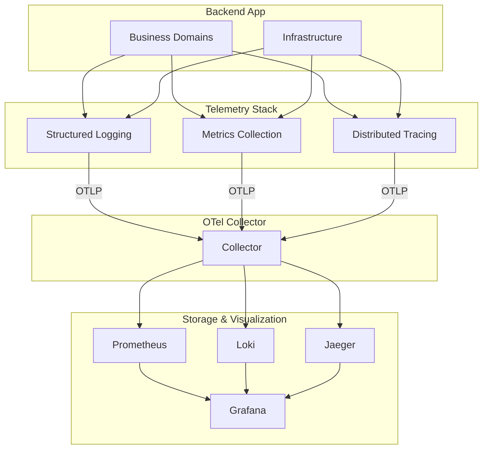

# Telemetry Stack

The Telemetry Stack provides comprehensive observability using OpenTelemetry.

## Architecture

## Components

| Component | Location | Purpose |
|-----------|-----------|---------|
| Structured Logging | `logger/` | Log aggregation |
| Metrics Collection | `metrics/` | Metrics collection |
| Distributed Tracing | `span/` | Trace spans |

## Three Pillars

### Logs

- Format: JSON or TEXT
- Levels: DEBUG, INFO, WARN, ERROR
- Export: OTLP to Loki

### Metrics

- Type: Counters, Histograms
- Export: Prometheus
- Record: Request count, latency

### Traces

- Tool: OpenTelemetry
- Export: Jaeger
- Purpose: Track request flow

## Related

- [infrastructure/telemetry/logger/README.md](Structured Logging)
- [infrastructure/telemetry/metrics/README.md](Metrics Collection)
- [infrastructure/telemetry/span/README.md](Distributed Tracing)
- [[docs/architecture-overview.md|Observability]]
