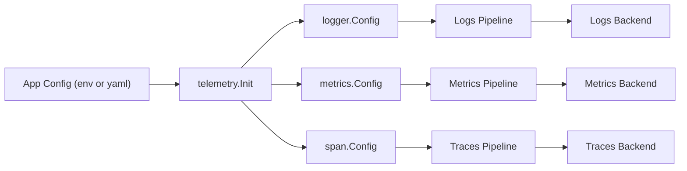

# Telemetry Configuration

This document defines a **single, app-level configuration** that drives logs, metrics, and traces for services using the telemetry package.

## Goals

- One place to set **service identity**, **collector endpoint**, and **environment**.
- Consistent defaults across logs, metrics, and spans.
- Easy override using **env vars** (recommended for deployment).

## Configuration Diagram



## Environment Variables (Recommended)

| Variable | Type | Default | Description |
|----------|------|---------|-------------|
| `OTEL_SERVICE_NAME` | string | **required** | Service name, appears as `service.name`. |
| `OTEL_COLLECTOR_ENDPOINT` | string | `localhost:4317` | OTLP gRPC endpoint for logs/metrics/traces. |
| `OTEL_ENVIRONMENT` | string | `development` | Deployment environment: `development` or `production`. |
| `OTEL_INSECURE` | bool | `true` (dev), `false` (prod) | Use insecure OTLP transport. |
| `OTEL_LOGS_ENABLED` | bool | `true` | Export logs via OTLP in addition to console. |
| `OTEL_LOG_LEVEL` | string | `info` | Log level: `debug`, `info`, `warn`, `error`. |
| `OTEL_LOG_FORMAT` | string | `text` (dev), `json` (prod) | Console output format. |
| `OTEL_METRICS_INTERVAL` | duration | `15s` (dev), `30s` (prod) | Metrics export interval. |
| `OTEL_TRACE_SAMPLE_RATE` | float | `1.0` (dev), `0.1` (prod) | Trace sampling ratio (0-1). |

## Example `.env`

```env
OTEL_SERVICE_NAME=user-service
OTEL_COLLECTOR_ENDPOINT=otel-collector:4317
OTEL_ENVIRONMENT=production
OTEL_INSECURE=false
OTEL_LOGS_ENABLED=true
OTEL_LOG_LEVEL=info
OTEL_LOG_FORMAT=json
OTEL_METRICS_INTERVAL=30s
OTEL_TRACE_SAMPLE_RATE=0.1
```

## Example `config.yaml`

```yaml
telemetry:
  serviceName: user-service
  collectorEndpoint: otel-collector:4317
  environment: production
  insecure: false

  logs:
    enabled: true
    level: info
    format: json

  metrics:
    pushInterval: 30s

  traces:
    sampleRate: 0.1
```

## Mapping to Telemetry Clients

| App Config Field | logger.Config | metrics.Config | span.Config |
|------------------|---------------|----------------|-------------|
| `serviceName` | `ServiceName` | `ServiceName` | `ServiceName` |
| `collectorEndpoint` | `CollectorEndpoint` | `CollectorEndpoint` | `CollectorEndpoint` |
| `environment` | `Environment` | `Environment` | `Environment` |
| `insecure` | `Insecure` | `Insecure` | `Insecure` |
| `logs.enabled` | `LogsEnabled` | - | - |
| `logs.level` | `Level` | - | - |
| `logs.format` | `Format` | - | - |
| `metrics.pushInterval` | - | `PushInterval` | - |
| `traces.sampleRate` | - | - | `SampleRate` |

## Recommended Defaults

- **Development:** `insecure=true`, `log.format=text`, `metrics.interval=15s`, `trace.sampleRate=1.0`
- **Production:** `insecure=false`, `log.format=json`, `metrics.interval=30s`, `trace.sampleRate=0.1`

## Collector Strategy

A **single OTel Collector** is recommended for all signals. Use separate pipelines inside the collector config for logs, metrics, and traces. Split collectors only if you need isolation or different scaling per signal.
