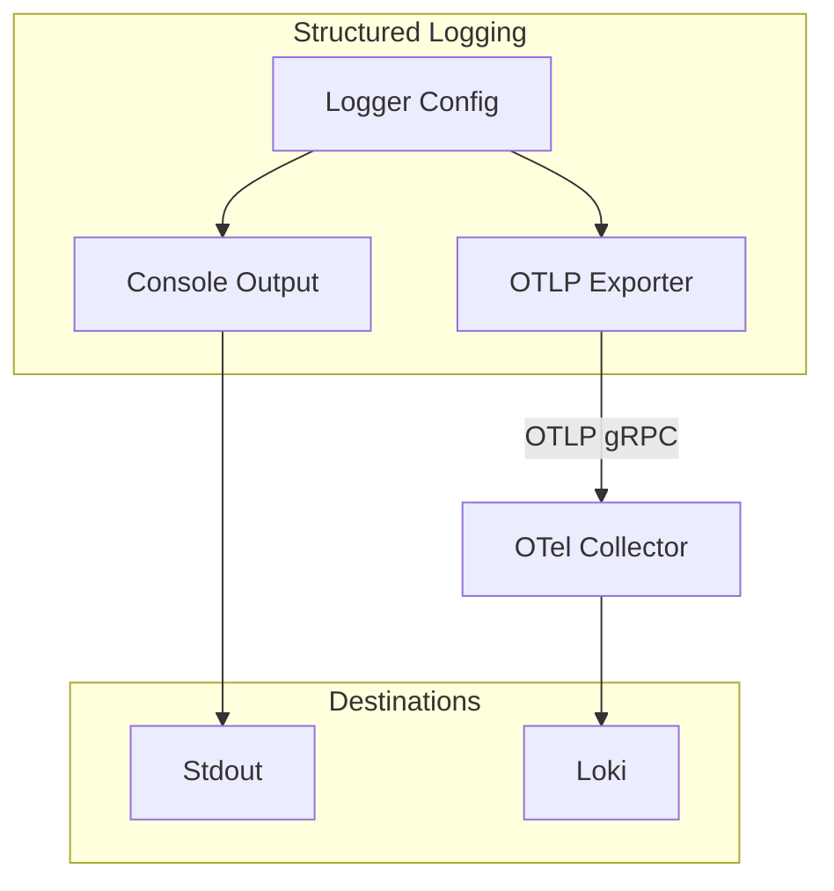

# Structured Logging

Structured logging provides consistent, machine-readable logs.

## Architecture



## Features

- Structured log format (JSON)
- Multiple log levels (DEBUG, INFO, WARN, ERROR)
- OTLP export to Loki
- Console output for local dev

## Usage

```go
logger.Info("request started", map[string]any{
    "method": r.Method,
    "path": r.URL.Path,
})

logger.ErrorError("operation failed", err, map[string]any{
    "user_id": userID,
})
```

## Configuration

| Variable | Default | Description |
|----------|---------|-------------|
| `LOG_LEVEL` | INFO | Minimum log level |
| `LOG_FORMAT` | TEXT | Log format (TEXT or JSON) |

## Related

- [infrastructure/telemetry/README.md](Telemetry Stack)
- Loki
- [[docs/architecture-overview.md|Observability]]
