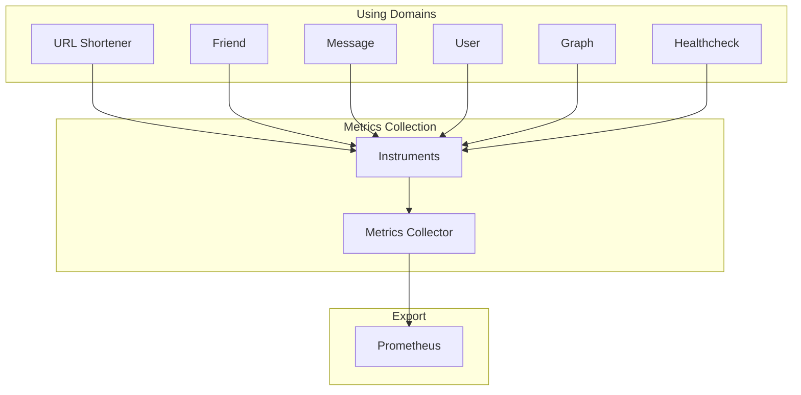

# Metrics Collection

Metrics collection tracks quantitative data for observability.

## Architecture



## Metrics Types

### Counters

- `http_requests_total`: Total HTTP requests
- Broken down by: method, route, status

### Histograms

- `http_request_duration_seconds`: Request latency in seconds
- `response_time_seconds`: Response time tracking

## Usage

```go
metrics.HTTPRequests.With(
    labelValues...method, route, status,
).Inc()

metrics.HTTPRequestDuration.Observe(duration.Seconds())
```

## Export

- **Format**: Prometheus
- **Endpoint**: `/metrics`
- **Collection**: Push to Prometheus via OTel Collector

## Related

- [infrastructure/telemetry/README.md](Telemetry Stack)
- Prometheus
- [[docs/architecture-overview.md|Observability]]
