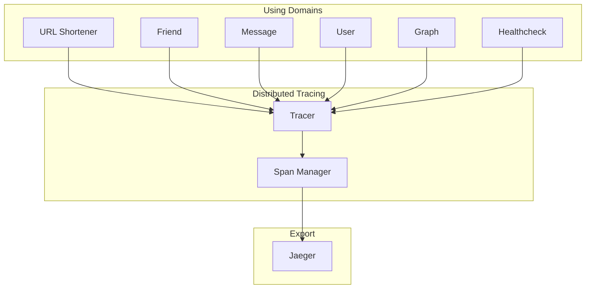
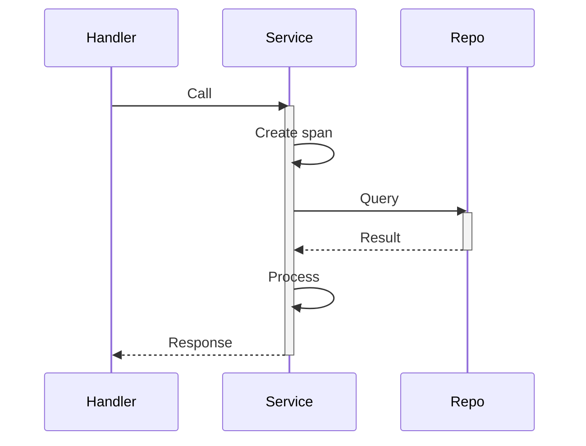

# Distributed Tracing

Distributed tracing tracks request flow across components.

## Architecture



## Features

- Trace context propagation
- Hierarchical spans (parent-child)
- Attribute and event annotation
- Error tracking

## Usage

```go
tracer := otel.Tracer("service-name")
ctx, span := tracer.Start(ctx, "operation-name")
defer span.End()

span.SetAttributes(attribute.String("key", "value"))
span.AddEvent("event-name")
```

## Span Hierarchy



## Export

- **Tool**: OpenTelemetry
- **Visualization**: Jaeger
- **Endpoint**: `http://localhost:16686`

## Related

- [infrastructure/telemetry/README.md](Telemetry Stack)
- Jaeger
- [[docs/architecture-overview.md|Observability]]
