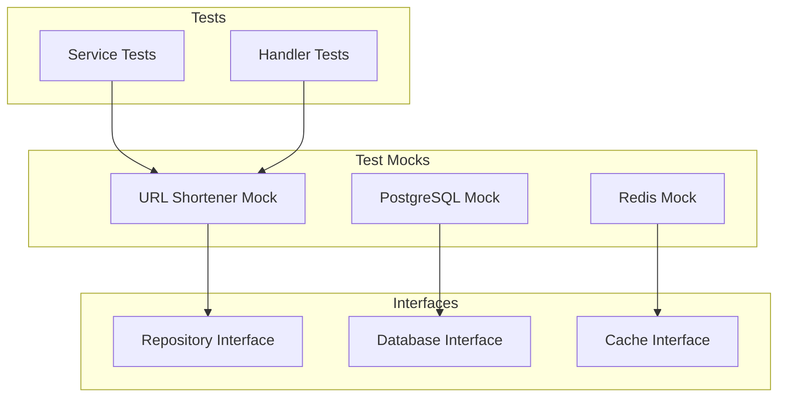

# Test Mocks

Test mocks provide test doubles for interfaces in the codebase.

## Purpose

- Isolate units under test
- Control external dependencies
- Speed up test execution
- Enable deterministic testing

## Architecture



## Generation

Mocks are generated for all Repository interfaces:

```bash
mockgen -source=domain/url-shortener/repository/repository.go \
  -destination=mock/urlshortener_mock.go
```

## Usage

```go
mockRepo := &mock.URLShortenerRepositoryMock{
    FindByShortCodeFunc: func(ctx context.Context, code string) (*URLMapping, error) {
        return &URLMapping{ShortCode: "abc123"}, nil
    },
}

service := NewService(mockRepo)
```

## Benefits

- Easy mocking for tests
- Swapping implementations without changing domain logic
- Testing domain layer independently of infrastructure

## Related

- [[docs/repository-pattern.md|Repository Pattern]]
- [[docs/repository-pattern.md|Repository Interface]]
- [domain/url-shortener/README.md](Domain Services)
