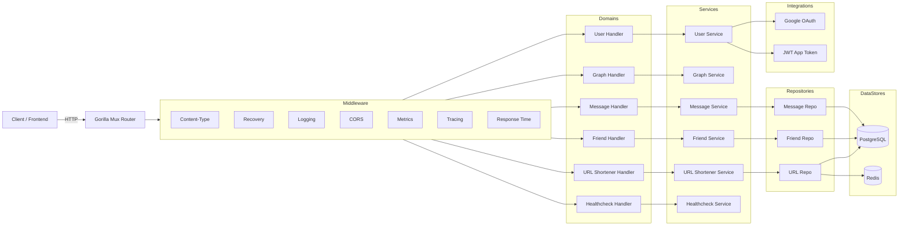
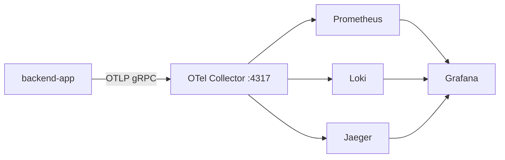
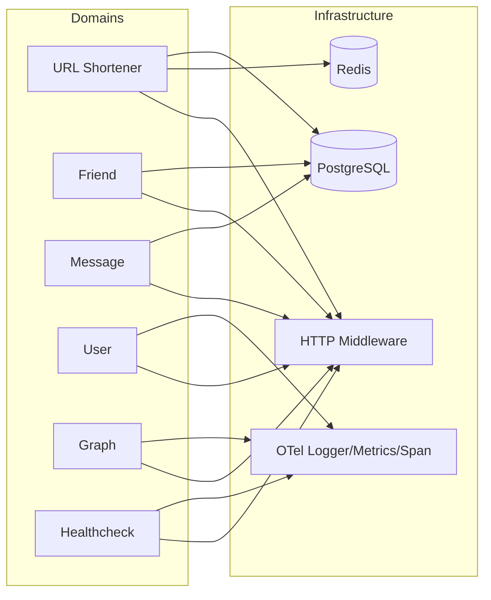

# Backend App — Copilot Notes

This document explains the backend architecture, observability, folder layout, infrastructure/domain connections, and how to run locally.

## Architecture (Code-Level)



## Observability (Logs, Metrics, Traces)

### How it’s wired
- **Logs**: `infrastructure/telemetry/logger` writes structured logs and optionally exports via OTLP.
- **Metrics**: `infrastructure/telemetry/metrics` defines HTTP counters and duration histograms.
- **Traces**: `infrastructure/telemetry/span` instruments spans; HTTP requests are wrapped via `otelhttp.NewHandler`.

### Runtime flow


### Where to look
- **Collector & stack**: `backend-app/infrastructure/instance/local/`
- **Collector config**: `backend-app/infrastructure/instance/local/otel-collector.yaml`
- **K8s observability**: `backend-app/infrastructure/deploymnet/`

### Key middleware signals
- `MetricsMiddleware` records request count + latency by method, route, and status.
- `TracingMiddleware` creates HTTP spans per route group.
- `LoggingMiddleware` emits request start/end with duration.

## Folder Structure

```
backend-app/
  binary/
    main.go
    http/
      main.go
      .env
      Dockerfile
      Makefile
      docs/                  # Swagger output
  domain/
    url-shortener/
      dto/ handler/ integration/ repository/ service/
    graph/
      handler/ service/
    friend/
      dto/ handler/ repository/ service/
    message/
      dto/ handler/ repository/ service/
    user/
      dto/ handler/ integration/ service/
    healthcheck/
      handler/ service/
  infrastructure/
    database/
      postgres/
      redis/
    http/
      middleware/
      server.go
    telemetry/
      logger/ metrics/ span/
    instance/
      local/                 # docker-compose + observability stack
    deploymnet/
      collector/ deployments/
  mock/
```

## Technology Stack

- **Language**: Go 1.25
- **HTTP Routing**: `gorilla/mux`
- **DB Access**: `sqlx`, `lib/pq` (PostgreSQL)
- **Cache**: `go-redis`
- **Auth**: Google OAuth (`x/oauth2`) + JWT (`golang-jwt`)
- **Observability**: OpenTelemetry SDK + `otelhttp`
- **API Docs**: `swaggo/swag` + `http-swagger`
- **Infra**: Docker, docker-compose, optional Kubernetes manifests

## Domains and Infrastructure Connections

### Domain overview
- **URL Shortener**: cache-aside repo using PostgreSQL + Redis.
- **Friend**: friendship graph stored in PostgreSQL.
- **Message**: conversations stored in PostgreSQL.
- **User**: Google OAuth integration, issues JWT app tokens.
- **Graph**: algorithm endpoints (no DB dependency).
- **Healthcheck**: liveness checks only.

### Domain ↔ Infra map


### Infra components (what they do)
- **PostgreSQL** (`infrastructure/database/postgres`): SQL access + connection pooling.
- **Redis** (`infrastructure/database/redis`): cache client + health ping.
- **HTTP** (`infrastructure/http/middleware`): request logging, CORS, JSON enforcement, tracing, metrics, response time.
- **Telemetry** (`infrastructure/telemetry`): OTLP exporters for logs/metrics/traces.

## Local Start (Docker-first)

### 1) Start local dependencies (DB + observability)
```zsh
cd /Users/m.syamsularifin/go/portofolio/backend-app/infrastructure/instance/local
make start
```

This boots:
- OTel Collector (4317/4318)
- Jaeger UI (16686)
- Prometheus (9090)
- Grafana (3000)
- Loki (3100)
- Postgres (5432)
- Redis (6379)

### 2) Build Swagger + run backend container
```zsh
cd /Users/m.syamsularifin/go/portofolio/backend-app/binary/http
make up
```

### 3) Open Swagger UI
- `http://localhost:5000/swagger/index.html`

### 4) Verify observability
- Jaeger: `http://localhost:16686`
- Grafana: `http://localhost:3000`
- Prometheus: `http://localhost:9090`

### Common env overrides
Edit `backend-app/binary/http/.env` to adjust service name, OTEL endpoint, and DB settings.

---

If you want, I can add a short diagram for request lifecycle or include API route summaries.