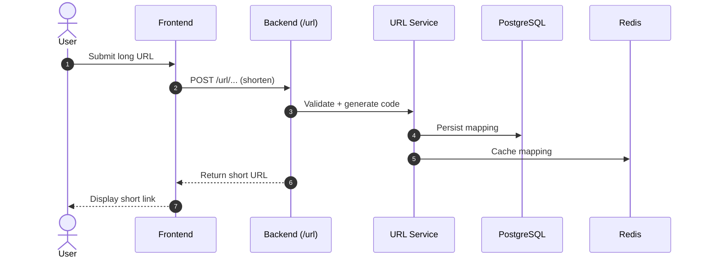
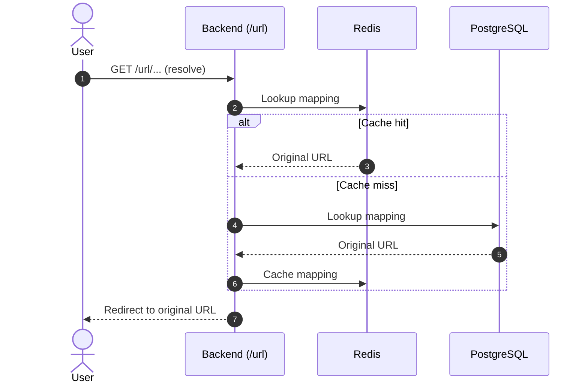
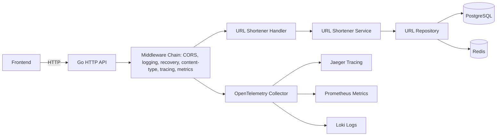

# URL Shortener (Frontend + Backend)

This folder contains the URL Shortener frontend and documents the backend it depends on. The backend entrypoint ("binary") is `backend-app/binary/http/main.go`.

## Overview

- **Frontend**: A simple HTML/JS UI for shortening URLs.
- **Backend**: A Go HTTP API that also hosts other domains (graph, friend, message, user, healthcheck). The URL shortener lives under the `/url` route group.

## Backend Walkthrough (Binary Entry)

The backend binary boot sequence in `backend-app/binary/http/main.go` follows this order:

1. **Load configuration** from environment variables (ports, DBs, telemetry, OAuth).
2. **Initialize logger** with OTLP support and log format/level.
3. **Initialize telemetry** (tracing + metrics) via OpenTelemetry.
4. **Connect to data stores**: PostgreSQL and Redis.
5. **Build HTTP router** (Gorilla Mux) and apply middleware.
6. **Register domain routes** (URL shortener, graph, friend, message, user, healthcheck).
7. **Expose Swagger UI** under `/swagger/`.
8. **Start server** with graceful shutdown.

## URL Shortener Domain (Backend)

- **Route group**: `/url` (subrouter)
- **Service**: constructed with `BaseURL` (used for short link generation)
- **Repository**: Postgres + Redis
- **Middleware chain**: response time, content type, recovery, logging, CORS, tracing

> The URL shortener domain is independent but shares the same binary with other domains.

## Backend Architecture

**Key layers** (as visible from the binary):
- **HTTP Layer**: `gorilla/mux` router + middleware chains
- **Domain Layer**: handlers → services → repositories
- **Infrastructure Layer**: Postgres, Redis, telemetry, logger

### Request Flow (Shorten)

### Request Flow (Resolve)

### Observability & Middleware View

## Tech Stack

- **Frontend**: HTML, JavaScript
- **Backend**: Go, Gorilla Mux
- **Data**: PostgreSQL, Redis
- **Telemetry**: OpenTelemetry (tracing + metrics)
- **Docs**: Swagger UI (`/swagger/`)

## Key Backend Routes (High-Level)

- **URL Shortener**: `/url/*`
- **Graph**: `/graph/*`
- **Friend**: `/friend/*`
- **Message**: `/message/*`
- **User**: `/user/*`
- **Healthcheck**: `/health/*`

## Configuration (Backend)

The binary uses environment variables (see `main.go`):

- **Server**: `SERVER_PORT`, `BASE_URL`
- **Postgres**: `POSTGRES_HOST`, `POSTGRES_PORT`, `POSTGRES_USER`, `POSTGRES_PASSWORD`, `POSTGRES_DB`, `POSTGRES_SSL`
- **Redis**: `REDIS_HOST`, `REDIS_PASSWORD`, `REDIS_DB`
- **Telemetry**: `OTEL_COLLECTOR_ENDPOINT`, `OTEL_METRICS_INTERVAL`, `SERVICE_NAME`, `ENVIRONMENT`
- **Logger**: `LOG_LEVEL`, `LOG_FORMAT`
- **Auth**: `GOOGLE_CLIENT_ID`, `GOOGLE_CLIENT_SECRET`, `GOOGLE_REDIRECT_URL`, `APP_TOKEN_SECRET`, `APP_TOKEN_TTL`

## Notes

- The backend binary is multi-domain; URL shortener is a route group within it.
- CORS, logging, recovery, tracing, and content-type middleware are applied per-domain.
- The healthcheck endpoint is `/health`.
