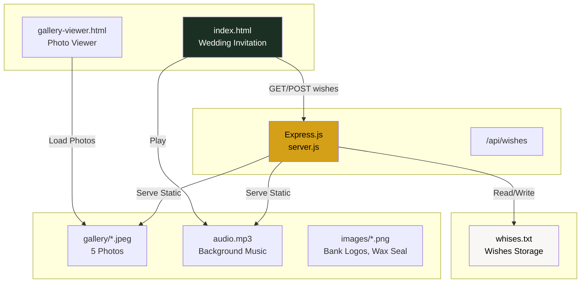
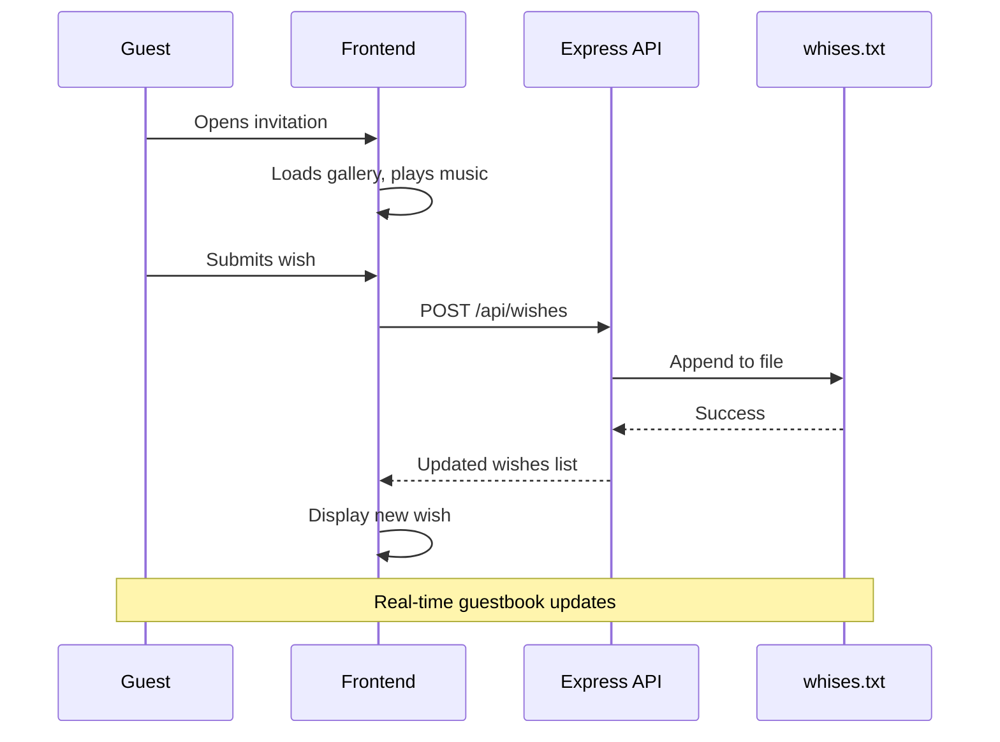
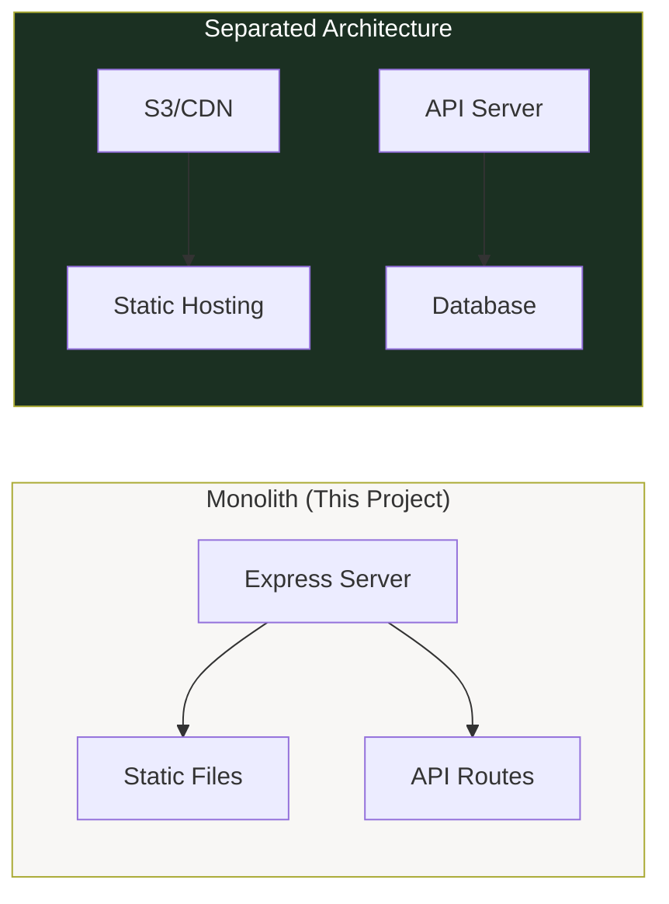

# Wedding Wishes Application

A fullstack wedding invitation with interactive guestbook, photo gallery, and ambient music.

## Quick Start

```bash
make wedding-start  # From root directory
# or
npm start           # From this directory
```

Visit http://localhost:2500

---

## Architecture



## Component Flow



## Skills Used

| Skill | Implementation |
|-------|----------------|
| **HTML5** | Semantic markup, structured content |
| **CSS3** | Custom animations, marble gradients, responsive design |
| **Tailwind CSS** | Utility-first styling via CDN |
| **JavaScript** | DOM manipulation, fetch API, gallery navigation |
| **Express.js** | RESTful API server, static file serving |
| **Node.js** | File system operations (fs/promises) |
| **Git** | Version control, deployment tracking |

## Folder Structure

```
wedding/
├── index.html              # Main wedding invitation (25KB)
├── gallery-viewer.html     # Photo gallery with nav (5KB)
├── server.js               # Express server, API endpoints
├── package.json            # Dependencies: express@4.19.2
├── whises.txt              # Guest wishes (file-based DB)
│
├── gallery/                # Photo gallery (5 photos)
│   ├── 1.jpeg
│   ├── 2.jpeg
│   ├── 3.jpeg
│   ├── 4.jpeg
│   └── 5.jpeg
│
├── images/                 # UI assets
│   ├── bca.png             # Bank transfer logo
│   ├── bni.png             # Bank transfer logo
│   └── wax.png             # Decorative wax seal
│
└── audio/
    └── audio.mp3           # Background music (3.8MB)
```

## Fullstack Approach

### Frontend (Static)
- **Served from:** `index.html`, `gallery-viewer.html`
- **Styling:** Tailwind CSS CDN + custom CSS
- **Interactivity:** Vanilla JavaScript
- **Assets:** Local files (gallery, images, audio)

### Backend (Express.js)
- **Purpose:** Guestbook API and static file serving
- **Port:** 3000 (configurable via `PORT` env)
- **Endpoints:**
  - `GET /api/wishes` - Fetch all wishes
  - `POST /api/wishes` - Submit new wish
- **Storage:** File-based (`whises.txt`)

### Separation Benefits



| Aspect | Current (Monolith) | Future (Separated) |
|--------|-------------------|-------------------|
| **Frontend** | Served by Express | Netlify/Vercel/CDN |
| **Backend** | Express + file storage | Render/Railway + DB |
| **Database** | Text file | PostgreSQL/MongoDB |
| **Scaling** | Single server | Independent scaling |

## Customization

| What | Where |
|------|-------|
| **Photos** | Replace `gallery/*.jpeg` |
| **Music** | Replace `audio.mp3` |
| **Text** | Edit `index.html` content |
| **Colors** | Edit `tailwind.config` in HTML |
| **Bank info** | Update account details in HTML |

## Deployment

| Platform | How |
|----------|-----|
| **Render** | Connect GitHub repo, start command: `npm start` |
| **Railway** | Auto-detect Node.js, set PORT env |
| **Fly.io** | `fly launch`, configure `PORT` |
| **Vercel** | Use `vercel.json` for API routes |

---

**Theme:** Forest Green (#1b3022) with Gold (#d4a017)
**Fonts:** Playfair Display, Montserrat, Great Vibes
