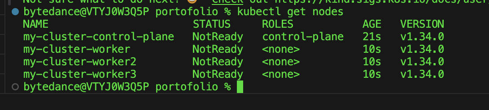

# How to start
Please follow all the instructions to have full working systems

## Preparations

- docker engine
- docker desktop
- docker compose
- kind (brew install kind for mac)

1. start kubernetes cluster locally: `make start-kubernetes`
2. check if kubernetes is running: `kubectl get nodes`



## Data layer
1. Postgres
    - make sure that `.env` file in `./binary/postgres` is set accordingly. This acts as an environment variable when running
    - create postgres secret: `make postgres-secret`
    - use docker image `postgres:16.3`. Pull it if you do not have it: `docker pull --platform=linux/amd64 postgres:16.3`
    - load docker image to kind cluster: `make load-postgres`
    - run postgres: `make postgres`
    - **optional**: you can test the postgres is up by forward the connection to your localhost: `make forward-postgres` and connect to it

        - _**user domain database**_: setup the required table for user domain by executing sql file in ```/domain/user/repository/table/ddl.sql```
        

2. Redis
    - make sure that `.env` file in `./binary/redis` is set accordingly. This acts as an environment variable when running
    - create secret: `make redis-secret`
    - use docker image `redis`. Pull it if you do not have it
    - load docker image to kind cluster: `make load-redis`
    - run redis: `make redis`
    - **optional**: you can test the redis is up by forward the connection to your localhost: `make forward-redis` and connect to it


## Service/Backend Layer
1. HTTP server
    - make sure that `.env` file in `./binary/http` is set accordingly. This acts as an environment variable when running
    - create secret: `make http-secret`
    - build the http image: `make build-http`
    - load docker image to kind cluster: `make load-http`
    - run: `make http`
    - **optional**: you can test the http is up by forward the connection to your localhost: `make forward-http` and connect to it. use postman ```portofolio.postman_collection.json``` to test the API


## UI/Frontend Layer
notes: to make the project simpler, I am not using any frontend framework. All the UIs are single page only and domain based

1. Main Page
    - build: ```make build-main-page```
    - load to cluster: ```make load-main-page```
    - run: ```make run-main-page```
    - forward port: ```make forward-main-page```, port that I use is 13000, feel free to configure it in makefile
    - check: in your browser, go to ```localhost:13000``` to check the page

    from this page, you can usually 

2. URL shortener

# Architechture
visit this diagram to understand more about the architecture: https://app.diagrams.net/#G16osGglyMotNDbr098PLH6Mqbj7DCFZUl#%7B%22pageId%22%3A%22cIc-d2nl0CKd4vElDnhN%22%7D

