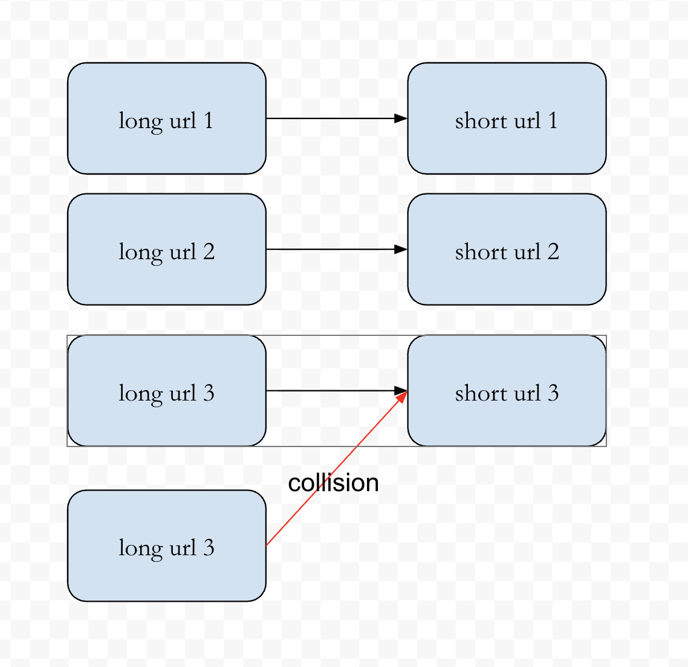

# How to start
Please follow all the instructions to have full working systems

## Preparations

- docker engine
- docker desktop
- docker compose
- kind (brew install kind for mac)

1. start kubernetes cluster locally: `make start-kubernetes`
2. check if kubernetes is running: `kubectl get nodes`


## Data layer
1. Postgres
    - make sure that `.env` file in `./binary/postgres` is set accordingly. This acts as an environment variable when running
    - create postgres secret: `make postgres-secret`
    - use docker image `postgres:16.3`. Pull it if you do not have it: `docker pull --platform=linux/amd64 postgres:16.3`
    - load docker image to kind cluster: `make load-postgres`
    - run postgres: `make postgres`
    - **optional**: you can test the postgres is up by forward the connection to your localhost: `make forward-postgres` and connect to it
    - do not forget to execute the tables for each domain
        - user: ```/domain/user/repository/table/ddl.sql```
        - url shortener (url): ```/domain/url/repository/table/ddl.sql```
        

2. Redis
    - make sure that `.env` file in `./binary/redis` is set accordingly. This acts as an environment variable when running
    - create secret: `make redis-secret`
    - use docker image `redis`. Pull it if you do not have it
    - load docker image to kind cluster: `make load-redis`
    - run redis: `make redis`
    - **optional**: you can test the redis is up by forward the connection to your localhost: `make forward-redis` and connect to it


## Service/Backend Layer
1. HTTP server
    - make sure that `.env` file in `./binary/http` is set accordingly. This acts as an environment variable when running
    - create secret: `make http-secret`
    - build the http image: `make build-http`
    - load docker image to kind cluster: `make load-http`
    - run: `make http`
    - forward: `make forward-http`, leave this port (1200) open

    - instead of doing build, create, load and run separately you may execute: ```make prepare-http```, but make sure that each step is covered correctly to prevent partial failure. I only recommend to execute this for restart or refresh the changes into the pods
    - **optional**: you can test the http is up by forward the connection to your localhost: `make forward-http` and connect to it. use postman ```portofolio.postman_collection.json``` to test the API


## UI/Frontend Layer
notes: to make the project simpler, I am not using any frontend framework. All the UIs are single page only and domain based

1. Main Page
    - build: ```make build-main-page```
    - load to cluster: ```make load-main-page```
    - run: ```make run-main-page```
    - forward port: ```make forward-main-page```, port that I use is 13000 and leave it open, feel free to configure it in makefile
    - check: in your browser, go to ```localhost:13000``` to check the page

    - instead of doing build, create, load and run separately you may execute: ```make prepare-main-page```, but make sure that each step is covered correctly to prevent partial failure. I only recommend to execute this for restart or refresh the changes into the pods

    main page is my portofolio, it will consist of my home made projects start from url shortener, chat, graph visualizer, monitoring, etc


# Projects
1. Url Shortener: it is self explanatory, just try it
2. Graph Visualizer: this is a project where i want to visualize several popular graph algorithms, thus make an easier understanding of the algorithms
3. Chat: self explanatory, you may test this app with your browser and incognito browser.
4. Code review: this is an integration with chat-GPT and Github. Whenever I create a pull request to this repo, an AI assistant will give some comments to give several insight that we might overlooked.


# Url Shortener
**Goal**: map the given long url to its short version, with small probability of collision



**Algorithm**:
1. for each shortening request, the system will create a random string with length of N characters
2. the length N is configurable parameter (```HASHER_LENGTH```)
3. each character will be randomize from a character pool that you defined (```HASHER_CHARACTER_POOL```). It can be lowercase only, uppercase only, alphanumeric, or any valid pool of characters
4. given sufficient N and character pool, the system can guarantee small amount of collision

**How to calculate collision**:
1. lets say you have set N and the character pool of size M
2. since we will randomize each character from ```1 ... N``` and each character will be chosen from ```M``` independently, the total number of all possibilities is ```M^N``` (the size of long url that can be shorten). 
3. Therefore, a single unique string created from this algorithm will have probability of ```1/(M^N)```
4. Based on this intuition, creating larger M and N will lead to smaller probability of collision

_notes: in case of collision, the system will reject the request and you need to manually re-shorten the url_

**Demo**
add demo here

# Architechture
visit this diagram to understand more about the architecture: https://app.diagrams.net/#G16osGglyMotNDbr098PLH6Mqbj7DCFZUl#%7B%22pageId%22%3A%22cIc-d2nl0CKd4vElDnhN%22%7D

